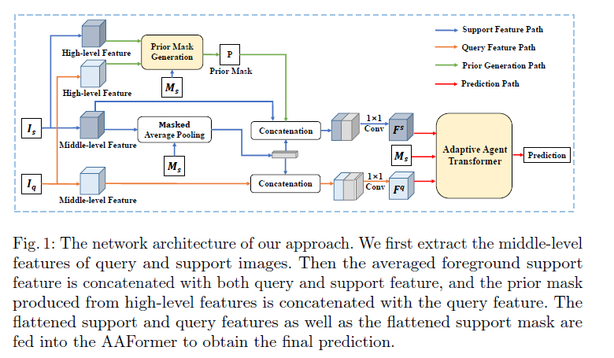
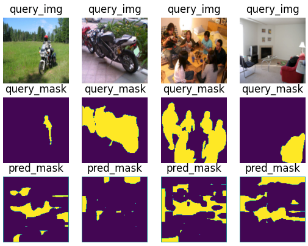
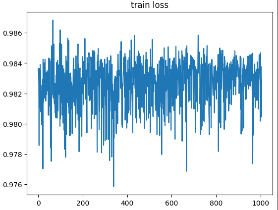
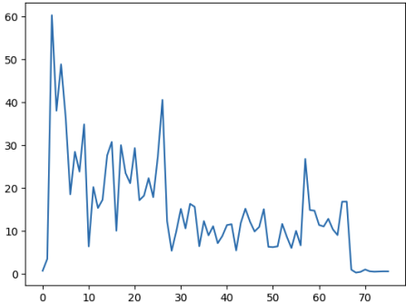
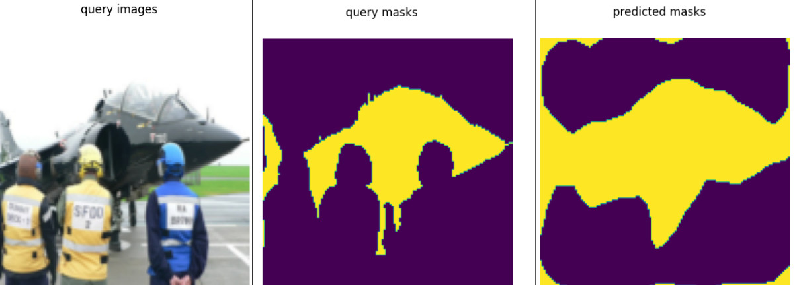
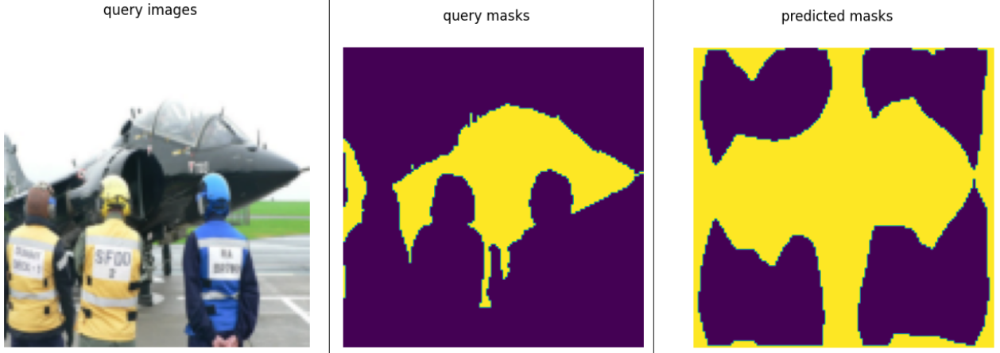
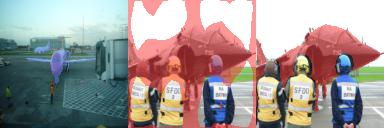
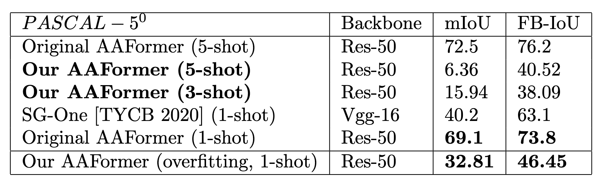

# Adaptive Agent Transformer for Few-shot Segmentation

This readme file is an outcome of the [CENG502 (Spring 2023)](https://ceng.metu.edu.tr/~skalkan/ADL/) project for reproducing a paper without an implementation. See [CENG502 (Spring 20223) Project List](https://github.com/CENG502-Projects/CENG502-Spring2023) for a complete list of all paper reproduction projects.

# 1. Introduction

In this paper, authors aim to address a few-shot segmentation (FSS) problem. They offer a new transformer-based architecture, called "Adaptive Agent Transformer" (AAFormer) that claims to surpass many state-of-the-art models, and it was published at ECCV 2022 conference. Our aim is to implement the AAFormer architecture with the guidance of the original paper and its supplementary material, and compare the results for reproducibility.

## 1.1. Paper summary

The objective of few-shot segmentation (FSS) is to segment objects in a given query image with the support of a few sample images. The major complication of FSS is the utilization of the limited information the support images incorporate. Some of the methods in the literature adopt prototypical learning or affinity learning strategies. Prototypical learning methods use masked average pooling to achieve a single prototype  to anticipate outperforming with noisy pixels while the affinity learning methods attempt to leverage pixel-to-pixel similarity between support and query features for segmentation. The proposed method in the paper (**AAFormer**) integrates the adaptive prototypes as agents into affinity-based FSS via a transformer encoder-decoder architecture. The transformers architecture has three main parts. The first part is the **Representation Encoder** which is very similar to the encoder part of the standard [transformer](https://arxiv.org/abs/1706.03762) structure which employs the self-attention mechanism for the query and support features separately and outputs the encoded support and query features to be fed to the **Agent Learning Decoder**. This is one of the two decoders in the model which injects the support information into learning agents to direct the information gathered with support images to the query image. The other decoder is the **Agent Matching Decoder** which yields the retrieved features after crossing the agent tokens with support and query features and aligning the outputs of them. [1]  

# 2. The method and our interpretation

## 2.1. The original method

- **Feature Extraction**:
The model takes the support and query image features as the inputs. These features are obtained by feeding the images into a pre-trained ResNet model. There are two types of image features for each support and query image: mid-level and high-level features. Mid-level features are the concatenated outputs of block2 and block3 and high-level features are obtained from block4 of ResNet architecture. In the paper performance comparison is presented among different ResNet architectures including 50 and 101 layers. High-level features are given to the **prior mask generator** with the corresponding support masks to form the prior mask. The same support image masks are also imported to the **masked average pooling** module with the mid-level support features. In the output of this module, mid-level query features are concatenated and are passed through a convolutional layer to obtain the final query features which are to be fed to the AAFormer. Like on explained in the query feature gathering branch, the final support level features are found by concatenating the prior mask with mid-level support features and the masked-out versions before the convolutional layer. In addition to final image features, support image masks are the inputs to AAFormer. The structure of this mechanism is given in [Figure 1](.\imagefolder\Figure1.png).

- **Representation Encoder**:
The support and query features obtained from pre-trained ResNet are reshaped before passing to the representation encoder. Each feature is fed to its own encoder after calculating the positional embeddings. Both of them are summed up and are used to find the query (Q), key (K), and value (V) matrices. After the softmax calculation of Q and K, V is multiplied to get the attention matrix. After that, it is fed to the feedforward network for the output of the encoder. Therefore, each support and query image features are encoded to proceed with the model.  

- **Initial Agent Tokens**: 
Adaptive Agent Transformer, takes an initial set of agent tokens at its Agent Learning Decoder stage. These tokens are initialized according to Algorithm 1, provided by the paper's supplementary material. The tokens are initialized by utilizing the n-shot mask information of the support images such that it will provide a good representation to bridge the information gap between query images and support images at the Agent Learning Decoder module. The tokens are initialized by selecting indices from support features. Specifically, the feature location where the foreground and background pixels' distance optimized is selected for every individual token.

- **Agent Learning Decoder**:
This decoder takes Initial Agent Tokens, Support Masks, as well as Support Features obtained from Representation Encoder as its input. The aim is to produce Agent Tokens that will bridge the gap between query features and support features such that these features can be aligned by Agent Matching Decoder in the next stage. In order to obtain these Agent Tokens, Initial Agent Tokens are fed into a masked cross-attention module together with Support Features in eqn.3. Then, the authors use Optimal Transport (OT) algorithm that condenses the set of agent tokens such that the tokens will be optimally different from each other.

- **Agent Matching Decoder**:
Both the encoded support and query features with learned agent tokens are passed to the Agent Matching Decoder. In the decoder, the transformer decoder architecture is adopted. The features and the learned agent tokens are fed to the cross-attention layer to form the cross-attention matrices. These matrices are multiplied together and an alignment matrix is used to form the aligned cross attention which rearranges the attention matrix. After that, softmax is calculated for the feedforward network. By the completion of this module, the outputs are available for the prediction task.

- **Prediction Layer**:
The last part of the model is the prediction module which employs two convolutional layers and a ReLU activation between them. At the output of the module, the network sequence is completed with a sigmoid function layer to predict the segmentation of the query image. 

## 2.2. Our interpretation 

Throughout our source code, we have discussed our interpretation and assumptions in detail at the comments starting with "`# Assumption:`".

* **Feature Extraction**: This section of the model is not comprehensively explained in the paper. [5], [6], and [7] have good discussions about the feature extraction procedure. The codework in this section is very dense. We use pre-trained ResNet with 50 layers to obtain the mid ad high layer features of the input and the query images. The prior mask calculation is not given in the paper, but [6] has detailed explanations of the process including the equations. The details of the concatenation are not clear such that in which dimension is to be taken into account. [5] explains the details of ResNet layers to be used to get the outputs concatenated.

* **Representation Encoder**: This part is rather plain than the other parts. This is the standard transformer encoder implementatation. However, there is no information about the positional embedding process. We code in paralled with [4].

* **Initial Agent Tokens**: There are several unclear parts of Algorithm 1 of the supplementary material. First, the definitions $X$ and $L$ are not clear. They are claimed to be the foreground and background pixels' locations set, yet there is no specification about how to obtain them. It can be trivially inferred the masks are where the foreground pixels exists; however, Algorithm 1 is supposed to work in feature space, not the original image space. Therefore, we assume the masks should be interpolated to feature space to obtain foreground pixel locations for $X$. Second, the selection of $x$ in line 3 seems to be unclear, in which we have implemented Algorithm 1 twice to see if one of our assumptions will work. The further information about these assumptions can be tracked from our comments at `tokens.py`.

* **Agent Learning Decoder**: The major change we have in this part is the interpretation of eqn.7. When we trackdown the matrices' dimensionalities, eqn.7 should be $FFN(SV^s)$ instead of $FFN(S)V^s$. We support our claim throughout the comments at `agentlearningdecoder.py` in detail. We assumed that there is a typo in eqn.7, since the same description of eqn.7 is also provided for eqn.12 (and there is a typo in eqn.12 description, $V^s$ is supposed to be $V^q$), which is the same with our claim. For OT algorithm, we have used Python Optimal Transport library (POT) [3].

* **Agent Matching Decoder**: In the Agent Matching Decoder, we take the standard transformer decoder structure as a reference. The tricky part of this module is the alignment matrix calculation which is element-wise with regard to cross-attention matrices. We see that there are some typos in the paper, especially in the equations given in this section.

* **Prediction Layer**: The prediction layer is not sufficiently discussed in the paper. The coarse structure is given yet some layers and the parameters are undefined. There are two convolutional layers, the first has 3x3 kernel, and the second 1x1 kernel. A ReLU activation is placed between them. After the second convolution layer, the output is interpolated in compliance with the original image resolution. For the output of the prediction first, we try a 2-dimensional convolution layer followed by an argmax layer. However, we face some drawbacks for the loss calculation with this setup and changed the last convolutional layer to a single channel followed by a sigmoid layer.   

# 3. Experiments and results

## 3.1. Experimental setup

We have implemented the setup of the original paper as closely as we could. The settings we have changed can be reviewed from the source code comments in detail. The paper uses 473 image resolution; however, we set the resolution to a lower value, i.e. 128 for our experiments. We provide our hyperparameters explicitly in `main.ipynb` and their values provided by the original paper and state the hyperparameters that are not mentioned in the paper. In addition to Dice Loss used by the original paper, we have also experimented with Binary Cross Entropy (BCE) Loss that is not used by the paper. 

We use `ResNet-50` as our backbone, where we also provide other ResNet options such as `ResNet-101`. The original paper uses the both in their ablation studies. For the datasets, we only experiment with $PASCAL-5^i$ which has 4 folds for cross-validation where $i$ denote the fold index, and every fold has 5 classes. We only experimented with the "fold0", i.e. we used $PASCAL 5^0$ (refer to Table 1's notation in original paper). We have experimented with 3-shot and 5-shot settings for $PASCAL-5^0$ Dataset. We also added an overfitting option to dataloaders that takes only one n-shot sample, and we run the overfitting experiment with 1-shot setting.

## 3.2. Running the code

Our main file is `main.ipynb` where we declare step by step code cells to run our code. Please refer to "Prepare Dataset" section's comments to review the steps of downloading and placing the dataset. PASCAL VOC2012 dataset can be downloaded [from here](http://host.robots.ox.ac.uk/pascal/VOC/voc2012/VOCtrainval_11-May-2012.tar) and the SBD extension is provided by [here](https://drive.google.com/file/d/10zxG2VExoEZUeyQl_uXga2OWHjGeZaf2/view) [2]. Extract the SBD extension's "SegmentationClassAug" folder inside "VOC2012" folder, and put "VOC2012" folder inside a folder named "Datasets". Finally, "Datasets" folder should be in the "AAFormer" folder (which contains this repo's source) if you are working on Colab, or it should be in the same directory with "AAformer" (i.e. not inside of AAFormer) if you will run the notebook on your local. After setting up the dataset, you should be able to run the notebook smoothly.

## 3.3. Results

Due to the computational limits, we couldn't train for 200 epochs as the paper did. Here we only provide results of 1 epoch training, which took 17 hours on a single GPU trained on Colab's T4. In addition, we provide an overfitting case of a single 1-shot sample, trained for 150 epochs.

### 3.3.1 Results of $PASCAL-5^0$ Dataset

**Figure.3:** Resulting masks at 1000th iteration for a batch size of 4.

**Figure.4:** Dice loss for 1000 mini-batch iterations (an epoch takes about 3000 iterations). The loss is pretty noisy accross the samples; however, we cannot declare that the model is not learning until we train the model for at least 10-20 epochs.

**Figure.5:** BCE Training Loss falling trend for 80 mini-batch iterations.

### 3.3.2 Overfitting Results

**Figure.6:** Overfitting experiment with BCE Loss + Dice Loss

**Figure.7:** Overfitting experiment with Dice Loss

**Figure.8:** Overfitting experiment with alternating Dice Loss / BCE Loss

**Figure.9:** Visualization of overfitted model's mask. Here we can observe the model's attempt to separate the plane with people occlusion.

**Table.1:** Numerical evaluation results, in comparison with original paper's Table.1. Our AAFormer model is trained for 3000 iterations on $PASCAL-5^0$.

# 4. Conclusion

The major difficulty we have faced is the speed of the algorithms used by the paper. Original paper trains AAFormer for 200 epochs whereas we could train the model for about 3000 iterations, which is almost 1 epoch. We believe our implementation can converge to similar results to the paper if it can be trained for longer. However, one epoch of our current implementation takes about 17 hours. One of the major drawbacks is the usage of foreground pixels explicitly, where every image has different number of foreground pixels and by definition, we cannot stack them in a single tensor. Therefore, we believe further details of foreground pixel computation should be provided by the supplementary material such that we can implement the algorithm efficiently. A similar problem also exists with OT algorithm used by the paper, which we assume should be computed for every sample separately as also discussed in our source code comments. Even though we have completed the implementation of every section given in the paper, the lack of parallelism in some algorithms becomes a major drawback to reproduce the results of the paper.

To compensate the computational efficiency problem, we provide results of our overfitting experiments computed by a single 1-shot sample of $PASCAL-5^i$ dataset. After training for 150 epochs, the model seems like to converge a solution that resembles the segmentation mask we would like to obtain. From the results listed in Table 1, and comparing with the Table 1 of original paper, we can observe that our overfitting results are getting closer to state-of-the-art models, which can indicate a potential learning capability of the reproduced AAFormer model. 

The few-shot segmentation problem is an interesting and challenging problem, and AAFormer model claims to improve state-of-the-art models with its Adaptive Agent scheme. However, the reproduction of AAFormer model is also challenging with additional computational complexities. In conclusion, we have built a naive implementation of AAFormer based on the information provided by the original paper and since our implementation takes about 17 hours per epoch, we provide our best results from an overfitting case, together with numerical evaluations of mIoU and FB-IoU metrics.

# 5. References

[1] Yuan Wang, Rui Sun, Zhe Zhang, and Tianzgu Zhang. " Adaptive Agent Transformer for Few-Shot Segmentation". (ECCV), 2022.

[2] Juhong Min, Dahyun Kang, and Minsu Cho. Hypercorrelation squeeze for few-shot segmentation. In Proceedings of the IEEE/CVF International Conference on Computer Vision
(ICCV), 2021.

[3] R ́emi Flamary, Nicolas Courty, Alexandre Gramfort, Mokhtar Z. Alaya, Aur ́elie Boisbunon, Stanislas Chambon, Laetitia Chapel, Adrien Corenflos, Kilian Fatras, Nemo Fournier, L ́eo
Gautheron, Nathalie T.H. Gayraud, Hicham Janati, Alain Rakotomamonjy, Ievgen Redko, Antoine Rolet, Antony Schutz, Vivien Seguy, Danica J. Sutherland, Romain Tavenard, Alexander Tong, and Titouan Vayer. Pot: Python optimal transport. Journal of Machine Learning Research, 22(78):1–8, 2021.

# Contact

Yusuf Soydan, yusuf.soydan@metu.edu.tr

Bartu Akyürek, bartu.akyurek@metu.edu.tr

