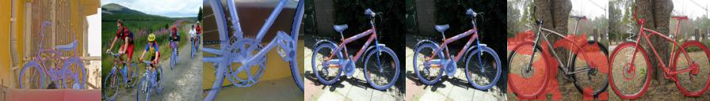

## Visual Results

Here we provide additional results. The rightmost image is the ground truth, the red masks are for the query image, and blue masks are from the support images (i.e. 5 blue masked images means we are training with 5-shot setting). The red masked image on the left of the rightmost image is our predicted mask.

These results are obtained from **iteration 2845** (almost 1 epoch) of AAFormer model, trained on $PASCAL-5^i$ dataset at $i=0$ fold.
Note that original paper trains for 200 epochs, which we couldn't achieved due to computational limits and efficiency.
