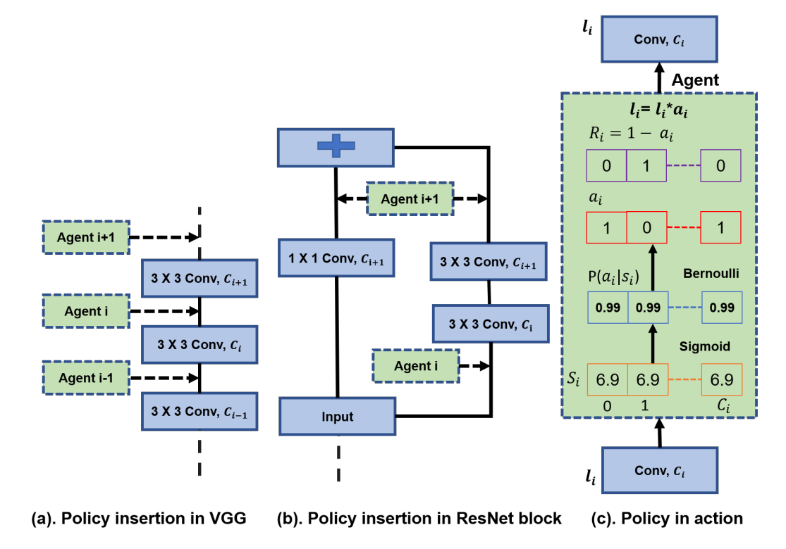
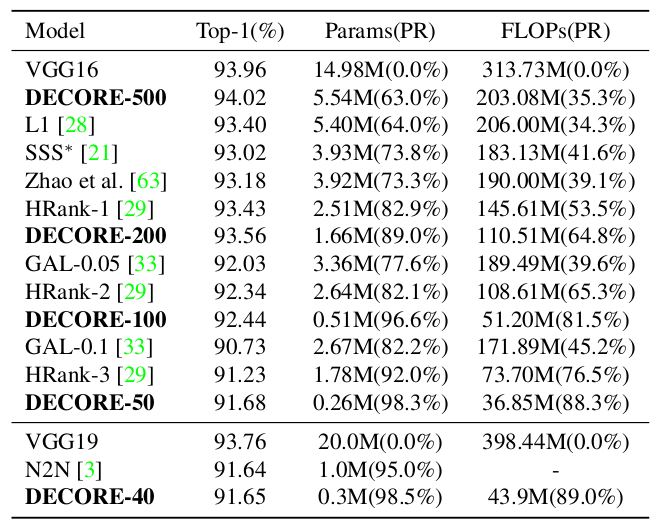
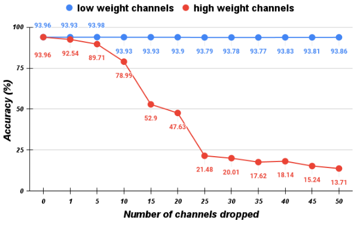

# DECORE: Deep Compression with Reinforcement Learning


# 1. Introduction

<!--- @TODO: Introduce the paper (inc. where it is published) and describe your goal (reproducibility). ---> 
This is paper is published in CVPR 2022. Our goal is to re-implement the proposed model and study its capability and limitations.

## 1.1. Paper summary

<!--- @TODO: Summarize the paper, the method & its contributions in relation with the existing literature.--->
The paper proposes a model called 'DECORE' which aims to compress a deep model architecture by dropping channels or linear layers of low importance, the proposed model is based on a multi-agent reinforcement framework. Previous works targeted the problem of compressing AI models, such as pruning weights based on the network statistcs and learning channel's importance subject to compression constraints, reinforcement learning has been also used to find optimized model's
architecture, however, all these methods suffer from high complexity due to iterative search and fine-tuning. This work work proposed a model in which the 
architecture search and fine-tuning are independent which helps in speeding up the compression process. 

# 2. The method and my interpretation

## 2.1. The original method

Given a Deep Model, the 'DECORE' framework assigns an agent to each layer of the model similar to [Figure 1](#figure_1), the agent holds a vector $s_i \in \mathbb{R}^{C_i}$, where ${C_i}$ is the number of channels within layer $l_i$ and $s_i$ is the state representation of the layer. The state representation is mapped to actions according to the
following policy



<a name="figure_1"></a>
**Figure.1:** (a) Agents are inserted after the convolution layer. (b) For Networks that has parallel pathes such as ResNet, the same policy will be shared between the parallel pathes. (c) the sampled actions $a_i$ are multiplied with the layer's activation $l_i$ to drop or activate the channel. *Disclaimer:* This figure is taken from the original paper.


$$ p_j = \frac{1}{1+e^{-w_j}}$$

<a name="equation_1"></a>

$$\begin{equation}
\pi_{j} = 
  \begin{cases}
  1 & \text{with } p_j \\
  0 & \text{with } 1 - p_j
  \end{cases}
\end{equation}$$

$$a_i = \{\pi_0,\pi_1,...,\pi_{C_i}\}$$

where $w_j$ is the importance weight of channel $j$ and $w_j \in s_i$, $\pi_{j}$ is the policy function which samples actions $\{1,0\}$ according to Bernoulli process. $p_j$ is the probability distribution of $\pi_j$. The model computes a compression reward according to: 
$$R_{i,C} = \sum_{j=1}^{C_i} 1 - a_{i,j}$$
the model incurs a penalty $\lambda$ for incorrect predictions as:

$$\begin{equation}
R_{acc} = 
  \begin{cases}
  1 & \text{if } y_{P cred} == y_{True} \\
  -\lambda & \text{otherwise }
  \end{cases}
\end{equation}$$


The cost function is:
$$max_{w} J(w) = \sum_{i=1}^{L} max_{w} E_{\tau \sim \pi_{w}(\tau_i)}[R_i]$$
and REINFORCE policy gradient algorithm is used to learn policy parameters $w$.

$$\begin{equation}
\nabla_w J(w) = \sum_{i=1}^{L}  \nabla_w E_{\tau \sim \pi_{w}(\tau_i)}[R_i]
\end{equation}$$

$$\begin{equation}
\nabla_w J(w) = \sum_{i=1}^{L}   E_{\tau \sim \pi_{w}(\tau_i)}[\nabla_w log \pi_{w}(a_i|s_i)R_i]
\end{equation}$$

<a name="equation_5"></a>

$$\begin{equation}
\nabla_w J(w) = \frac{1}{N} \sum_{b=1}^{N} \sum_{i=1}^{L} [\nabla_w log \pi_{w}(a_{b,i}|s_{b,i})R_{b,i}]
\end{equation}$$

In equation [5](#equation_5), $N$ indicates the size of a batch and $L$ is the depth of the network, the gradients update the policies of the weights $w$ at each layer.

## 2.2. Our interpretation 

<!--- @TODO: Explain the parts that were not clearly explained in the original paper and how you interpreted them.---> 
In the REINFORCE policy gradient algorithm, the infer of $\pi_w(a_i | s_i)$ was not clear, in this implementation it is interpreted as:
$$\pi_w(a_i | s_i) = P(a_i|s_i) = \prod_{j=1}^{C_i} P(a_{i,j}|s_{i,j})$$

Moreover, in equation [5](#equation_5), the authors have labeled the state representation as $s_{b,i}$ which indicates that for each element within the the batch there will be a different state, however, we think this is incorrect notation as the weights or policies will only be updated after each batch pass, hence, in this implementation we assumed that $s_{b,i}$ is fixed for each batch, only $a_{b,i}$ changes as it is sampled from a Bernoulli process. 

The rest of our implementation follows the same structure of the original work, at first the model is  embedded with agents after each convolution layer, an agent takes an action based on the policy described by equation [1](#equation_1), the taken action works as a mask which either passes the output of the channel in case action $a=1$ is taken or drops the channel's output in case $a=0$.

# 3. Experiments and results

## 3.1. Experimental setup

The original work tests their framework by compressing four different models, namely, VGG16, DenseNet,GoogleLeNet and ResNet. They used CIFAR-10 and IMAGENET as datasets.
During training, they used ADAM optimizer with learning rate 0.01 and batch size of 256, initial weights $w_j$ are initialized as 9.6. They  trained the model for 300 number of epochs with 260 for learning weights $w$ and 40 for fine-tuning the model after dropping channels with probabilities less than 50% on CIFAR-10. The metrics used to verified the proposed method are classification accuracy, Number of parameters and number of floating point operations (FLOPs). Throughout their experiments they have tested different values for penalty $\lambda$ to observe its effect on the metrics.

## 3.2. Running the code

<!--- @TODO: Explain your code & directory structure and how other people can run it.---> 
main.ipynb is a demo on how to deploy and use our implementation. 

At first, we import a pretrained VGG16 model and fine tune it on CIFAR-10 dataset, the classfication layer is replaced with a layer that has the same number of classes in CIFAR-10.

```ruby
# Import a pre-trained VGG16 and replace classification layer with new layer that has number of classes in CIFAR-10
vgg16 = models.vgg16(weights='IMAGENET1K_V1')
input_lastLayer = vgg16.classifier[6].in_features
vgg16.classifier[6] = nn.Linear(input_lastLayer,10)
```
After fine tuning the target model, in this case VGG16, it is passed to the 'DECOR' module in which the model will be embedded with agents. For optimizer, only the state representations $s_i$ of each layer will be updated throughout the training process, other parameters of the model are fixed.
The 'CustomLoss' module implements the cost function in equation [5](#equation_5) with our interpretation in section 2.2, the input to this module is the value of penalty $\lambda$.

```ruby
num_epochs = 1
lr = 0.01
net = DECOR(model)
net = net.to(device)

id = 0
param = []

for n,p in net.named_parameters():
    if n.endswith(f".S_{id}") and p.requires_grad:
        param.append(p)
        id += 1
        
optimizer = Adam(param, lr=lr)
criterion = CustomLoss(-200)
```
The model then can be trained and the state representations $s_i$ will be updated after each batch pass

```ruby
import gc
gc.collect()
torch.cuda.empty_cache()
print(torch.cuda.mem_get_info())

for epoch in range(num_epochs):
    #train_loss = 0.0
    for i, (imgs , labels) in enumerate(train_loader):
        imgs = imgs.to(device)
        labels = labels.to(device)
        labels_hat = net.target_model(imgs)
        loss_value = criterion(net.agents_list,labels_hat, labels)
        #train_loss += loss_value.detach().cpu().item() / len(train_loader)
        optimizer.zero_grad()
        loss_value.backward()
        optimizer.step()
        if (i+1) % 250 == 0:
           print(f'epoch {epoch+1}/{num_epochs}, step: {i+1}/{n_total_step}: loss = {loss_value:.5f}')
    print()
```

Finally, the trained model can be retrieved as

```ruby
target_model = net.target_model
```

where the agents can be removed and channels that have state representation with probability less than 50% can be pruned.

## 3.3. Results

<!--- @TODO: Present your results and compare them to the original paper. Please number your figures & tables as if this is a paper.--->
We could not reproduce the results in the paper because of unclarity of $\pi_w(a_i | s_i)$, during training we noticed that the favoured actions are to activate all channels hence no compression is osbserved, we expect that this is due to initialization of state representation $s_i$ as 9.6 which gives high probability to all actions to be 1 and thus gradient of the cost function will be almost zero.

Below are some results obtained by the original paper:



<a name="figure_2"></a>
**Table.1:** Accuracy, Number of Parameters, and number of FLOPs for VGG16 models compressed using different penalty (e.g. DECORE-500 has $\lambda=-500$) compared with the original model and other state of the art methods in literature. *Disclaimer:* This Table is taken from the original paper.




<a name="figure_3"></a>
**Figure.2:** The curves show the effect of removing channels with high weights (High importance) and low weights (low importance) on the accuracy of the model, the figure shows that proposed model by the orignal work can learn the important channels in a deep model. *Disclaimer:* This figure is taken from the original paper.


# 4. Conclusion

<!---@TODO: Discuss the paper in relation to the results in the paper and your results.--->
Although the paper proposes a promising work for compressing deep models, due to lack of some details or misinterpreting the model could not be verified. During training process we observed that the loss function is barely changing and hence the state representation or weights do not change significantly, our reasoning is that initializing the weights at 9.6 gives probability of taking action $a=1$ to be 99%, as a result almost all channels are activated, thus the model does not experience action $a=0$ enough to cause a significant change in the gradient. We propose that initializing the state representation at 0 could result in an effective compressing as in this case the probability of taking actions $a=1$ or $a=0$ have 50% probability.

# 5. References

<!---@TODO: Provide your references here.--->
DECORE: Deep Compression with Reinforcement Learning, 2022, Manoj Alwani, Yang Wang, Vashisht Madhavan

# Contact

<!---@TODO: Provide your names & email addresses and any other info with which people can contact you.--->
Mahmoud Alasmar (alasmar.mahmoud@metu.edu.tr)
