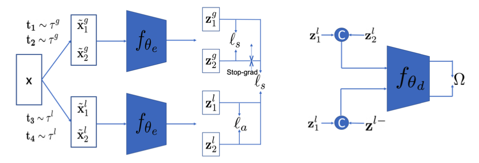

# [Leverage Your Local and Global Representations: A New Self-Supervised Learning Strategy](https://openaccess.thecvf.com/content/CVPR2022/papers/Zhang_Leverage_Your_Local_and_Global_Representations_A_New_Self-Supervised_Learning_CVPR_2022_paper.pdf)

This readme file is an outcome of the [CENG502 (Spring 2023)](https://ceng.metu.edu.tr/~skalkan/ADL/) project for reproducing a paper without an implementation. See [CENG502 (Spring 2023) Project List](https://github.com/CENG502-Projects/CENG502-Spring2023) for a complete list of all paper reproduction projects.

# 1. Introduction

_Figure 1:_ LoGo structure on the left. Learned local affinity measure on the right. Figure (2) from the paper.

The paper, namely "Leverage Your Local and Global Representations: A New Self-Supervised Learning Strategy" by Zhang et al. [1], is published as a conference paper on CVPR 2022. It proposes a new self-supervised learning (SSL) strategy *_-LoGo-_* that can be adapted on top of existing SSL methods such as [MoCo](https://arxiv.org/abs/1911.05722)[2] (denoted as _MoCo-LoGo_) and [SimSiam](https://arxiv.org/abs/2011.10566)[3] (denoted as _SimSiam-LoGo_).

This implementation focuses on SimSiam-LoGo, implying that the proposed technique is applied to SimSiam [3]. The goal of this repository is to reproduce some of the results belonging to the section 4.2 of the paper: _"Training and evaluating the features"_.

## 1.1. Paper summary

A plethora of SSL methods rely on maximizing the similarity between representations of the same instance *(some further take negatives into account by methods such as large batch-sizes [4] or queues [2])*. These representations are aimed to be view-invariant, and thus origin from different views of the instance by applying random augmentations including random cropping.

These approaches are inherently limited by the fact that two random crops from the same image may be dissimilar, encoding different semantics. Pushing these features -regardless of the content- to be similar creates a bottleneck on the quality of the learned representations.

This paper addresses this problem by explicitly reasoning about the **Lo**cal and **G**l**o**bal views (crops) by:

1. Pulling global representations of the image together
2. Pulling local representations towards global representations of the image
3. Repelling local representations of the same image apart

# 2. The method and our interpretation

## 2.1. The original method

The method is aimed to be general, being applicable in both contrastive and non-contrastive scenarios. So, let's first do a quick review to lay the ground for the approach.

### 1. Similarity Loss

Similarity loss functions are used as objectives to maximize the similarity between two views. Two commonly used loss functions are:

1. Info-NCE [5] loss (known as the contrastive loss), used by contrastive methods such as MoCo [2]:


_Equation 1:_ Equation (1) from the paper.

Contrastive loss further accounts for the negatives, meaning that it pushes to minimize the similarity of the representation to the negatives, where negative samples may be drawn from the batch [4], or from a queue [2].

2. Cosine loss, used by non-contrastive methods such as SimSiam [3]:


_Equation 2:_ Equation (2) from the paper.

where either stop-gradient operation is applied [3] on z_2 branch or momentum encoder is used to obtain the representation z_2 [6].

### 2. The Method

Given the complex image content of the contemporary datasets, the driving motivations behind this method are:

1. Two different crops of the same image may capture entirely different semantics
2. Two random crops from different images may capture similar semantics, conversely

Hence, it is _suboptimal_ to consider views as positive only if they originate from the same image. To address this, LoGo proposes two different kinds of crops, i) local crops, and ii) global crops.

Specifically, each image is augmented twice, using the local and global set of augmentations, resulting in two global crops, and two local crops. Then, global-to-global, local-to-global and local-to-local relationships are optimized.

_Note that l_s denotes a similarity loss from the set above. Specifically for this implementation of SimSiam-LoGo, it denotes the Cosine loss._

#### Global-to-global
As global views cover most of the semantics of an image, maximizing the similarity between global views of the same image, and _optionally_ (for contrastive methods) minimizing the similarity between different images is aimed. The objective used here is:


_Equation 3:_ Equation (3) from the paper.

#### Local-to-global
Global crops are much more likely to capture the overall semantics of the image, while also sharing some of the semantic signal with the local crops. Therefore, they are treated as constant by either applying stop-gradient operation (SimSiam-LoGo) or fixing their representation in the momentum encoder (both denoted by sg()). The objective, then, is:


_Equation 4:_ Equation (4) from the paper.

#### Local-to-local
Contrary to most of the existing works, local crops from the same image are **encouraged** to be dissimilar, since they most likely depict different parts of an object or even entirely different objects. 

*Here, one should note that encouraging dissimilarity at some lovel is also a necessity to prevent collapse or trivial solutions.*

The objective used to encourage the dissimilarity is:


_Equation 5:_ Equation (5) from the paper.

where l_a denotes an affinity function (the higher, the more similar).

In principle, l_a can be any well-known similarity measure, such as the cosine similarity. On the other hand, however, the high-dimensional nature of the encoded representations would allow representations to be distant -using such metrics- in many directions, most of them being _meaningless_.

To incorporate more meaning _(and possibly ease the convergence of training)_, the method proposes to jointly train and use a _learned metric_ implemented as an MLP. The objective used to train it is motivated by the intuition that local crops from the same image are, on average, expected to encode more similar semantics, compared to local crops from different images. Hence, yielding the objective to be maximized:


_Equation 6:_ Equation (6) from the paper.

where f() denotes the MLP, z_1 & z_2 denotes local crops originating from the same image, and z_- denotes local crops from different images.

Altogether, the problem reduces to:


_Equation 7:_ Equation (9) from the paper.

where lambda balances the similarity and dissimilarity terms (set to 1e-4 for SimSiam-LoGo).

## 2.2. Our interpretation 
Regarding the pseudocode, it was not clear in the paper why they apply operations sequentially, rather than batch-processing.


_Algorithm 1:_ Algorithm (1) from the paper.

Considering the time and resource limitations, we went with batch-processing.

Further, some of the hyper-parameters were not declared, such as
1. The optimization settings for the MLP (learned metric)

    We've empirically found using lr=1e-4 was beneficial for training the MLP (larger learning rates caused in dead-relu-like problems since the softplus at the end). Optimizer settings are left the same with the ResNet's [7].

2. The sizes for global and local crops

    This is the part where our unsureness mostly lies. We've empirically chosen (0.65, 0.9) range for global, and (0.15, 0.4) range for local crops _(range values indicate the ratio of the area of the crop to the area of the source image)_.

# 3. Experiments and results

## 3.1. Experimental setup

We've trained _-a slightly modified version of_ ResNet-18 [7] on CIFAR10 [8] with the following hyper-parameters:

1. Prediction head output size: 2048
2. Number of projection head layers: 2
3. Batch-size: 512
4. Learning rate: 0.05 (_Paper uses 0.03_)
5. SGD with 0.9 momentum and 1e-4 weight decay (both for the ResNet [7] and the MLP)
6. Lambda value: 1e-4
7. 200 epochs
8. Cosine learning rate decay with minimum lr=0.0

Hyper-parameters listed above are the same with the paper unless otherwise is mentioned.

## 3.2. Running the code

First of all, create the environment:
```
conda create --name logo python=3.9
conda activate logo
```
Install the required dependencies:
```
pip install -r requirements.txt
```

### [CIFAR10 [8]](https://www.cs.toronto.edu/~kriz/cifar.html) 
To start CIFAR10 [8] training, run:
```
python SimSiam/main.py
```

### [ImageNet100](https://www.kaggle.com/datasets/ambityga/imagenet100)

Altough results are not available, if ImageNet100 training is desired, place your Kaggle credentials and run the download script:

```
bash download_data.sh
```

Then, start training (batch size set suitable on a single A100-80G):

```
python SimSiam/main.py --arch resnet34 --dataset imagenet100 --batch_size 384 --num_workers 16
```


## 3.3. Results

### CIFAR10 [8] Experiments


_Figure 2:_ SimSiam-LoGo training loss plot

Figure 1 illustrates the self-supervised training loss curve on the CIFAR10 [8] training set. Although not super-stable, we believe it is sufficient to prove that optimization is realized.


_Figure 3:_ SimSiam-LoGo kNN accuracy value (k=1)

Figure 2 plots the kNN classification accuracy on CIFAR10 [8] test set, k set to 1. Top performance is around **64.13%**, while in the paper it is reported as **87.67%** (see Table 1).

We believe that this performance gap probably originates from the fact that we had to guess some experimental settings, since they were not declared in the paper, especially global and local crop sizes.

# 4. Conclusion

The paper brings a novel view on SSL methods, relaxing the assumptions made by the majority of the literature, that can be applied to a variety of existing techniques such as MoCo [2] and SimSiam [3]. The main contribution of the paper is the idea of treating global and local views differently. The performance gains are consistent and significant both regarding the classification performance directly from the features of encoders and regarding the transfer learning performance, including dense prediction tasks.

In this repository, we've chosen to implement SimSiam-LoGo rather than MoCo-LoGo, since MoCo-LoGo had much more question marks regarding the implementation that was not declared in the paper, compared to SimSiam-LoGo.

Obviously, the kNN classification performance on CIFAR10 [8] test set that we've observed is significantly below what's stated in the paper. We believe that this performance gap can easily be remedied by setting the right combination of hyper-parameters.

# 5. References

[1] Zhang, T., Qiu, C., Ke, W., Süsstrunk, S., & Salzmann, M. (2022). Leverage your local and global representations: A new self-supervised learning strategy. In Proceedings of the IEEE/CVF Conference on Computer Vision and Pattern Recognition (pp. 16580-16589).

[2] He, K., Fan, H., Wu, Y., Xie, S., & Girshick, R. (2020). Momentum contrast for unsupervised visual representation learning. In Proceedings of the IEEE/CVF conference on computer vision and pattern recognition (pp. 9729-9738).

[3] Chen, X., & He, K. (2021). Exploring simple siamese representation learning. In Proceedings of the IEEE/CVF conference on computer vision and pattern recognition (pp. 15750-15758).

[4] Chen, T., Kornblith, S., Norouzi, M., & Hinton, G. (2020, November). A simple framework for contrastive learning of visual representations. In International conference on machine learning (pp. 1597-1607). PMLR.

[5] Oord, A. V. D., Li, Y., & Vinyals, O. (2018). Representation learning with contrastive predictive coding. arXiv preprint arXiv:1807.03748.

[6] Grill, J. B., Strub, F., Altché, F., Tallec, C., Richemond, P., Buchatskaya, E., ... & Valko, M. (2020). Bootstrap your own latent-a new approach to self-supervised learning. Advances in neural information processing systems, 33, 21271-21284.

[7] He, K., Zhang, X., Ren, S., & Sun, J. (2016). Deep residual learning for image recognition. In Proceedings of the IEEE conference on computer vision and pattern recognition (pp. 770-778).

[8] Krizhevsky, A., & Hinton, G. (2009). Learning multiple layers of features from tiny images.

# Contact

Erce Güder - guder.erce@metu.edu.tr

Ateş Aytekin - atesaytekinn@gmail.com