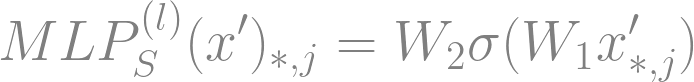

# Spatial-Channel Token Distillation for Vision MLPs

This readme file is an outcome of the [CENG502 (Spring 2023)](https://ceng.metu.edu.tr/~skalkan/ADL/) project for reproducing a paper without an implementation. See [CENG502 (Spring 20223) Project List](https://github.com/CENG502-Projects/CENG502-Spring2023) for a complete list of all paper reproduction projects.

# 1. Introduction

This project is an implementation of the paper [Spatial-Channel Token Distillation for Vision MLPs](https://proceedings.mlr.press/v162/li22c.html). The paper is published in ICML'22. The objective of the paper is to improve the information mixing in mixer architectures (token & channel mixing) by introducing additional tokens to be distilled for both token-wise and channel-wise. The paper combine the knowledge distillation idea with the all-MLP vision architectures. Overall, with the proposed methodology remarkable results can be obtained in the common vision datasets. 

The project codebase here is a snapshot and refers to a specific commit in the maintained version of the codebase: [devrimcavusoglu/std@7de3dd00e2d69dbcd2c91de959c1b027cead209d](https://github.com/devrimcavusoglu/std/tree/7de3dd00e2d69dbcd2c91de959c1b027cead209d). To see the up-to-date version of the STD project, open issues or for questions refer to [devrimcavusoglu/std](https://github.com/devrimcavusoglu/std).

## 1.1. Paper summary

All-MLP architectures have caught interest since their proposal [1,2,3]. [1] (MLP-Mixer) introduced an all-MLP architecture that does not depend on multihead self-attention (MSA) [6], but instead they proposed a more compute efficient way achieving competitive results with MSA by mixing information through token-mixing and channel-mixing blocks. These blocks allow to fuse information from token side and channel side. Although they mentioned that allMLP have not surpassed the best performance of vision transformers, they show that MSA is not necessary to attain high performance results. [2,3] proposed new techniques based on allMLP architectures [1], as [2] (ResMLP) extended this token-mixing architecture with building a residual network by adding skip-connections in the original mixer block of [1]. [3] (CycleMLP) introduced a method of "cycling" windows extending the mixer architecture that is (i) able to cope with various image sizes and (ii) it reduces the $O(N^2)$ complexity to $O(N)$ due to windowing. 

DeiT [4] proposed a methodology where the method of token distillation is proven to be working for vision transformers, and the distillation tokens help integrating additional features from mainly CNN architectures. Inspired by DeiT, [7] (STD) proposes a method to integrate this token distillation idea to all-MLP architectures. The method is mainly proposed to improve the inefficient mixing of the information in the mixer blocks in the original architecture of [1]. Moreover, STD methodology offers a generic framework that can be integrated into any allMLP and mixing architectures.

# 2. The method and my interpretation

## 2.1. The original method

### 2.1.1 The main concept


The key idea of the proposal to insert additional token(s) to the mixer layers for both token-mixing layer and channel-mixing layer in the mixer block. The mixer block includes two submodules token-mixing block and channel-mixing block, where token-mixing MLP assesses the mixing of spatial information and the channel-mixing MLP assesses the mixing of feature-wise information across channels within the same spatial location. Formally, given the feature $Z^{(l-1)} \in \mathbb{R}^{P \times N}$ of P patches with N channels, a mixer block applies token-mixing and channel-mixing consecutively,

$$ U^{(l)} = MLP_S^{(l)}(LN(Z^{(l-1)})) + Z^{(l-1)} $$

$$ Z^{(l)} = MLP_C^{(l)}(LN(U^{(l)})) + U^{(l)} $$

where $l = 1,2,...,L$ are L blocks, $LN(\cdot)$ is the layer norm., and MLP_S^{(l)} and MLP_C^{(l)} are the spatial and channel MLPs in block $l$, respectively. 

On top of this mixer block, STD proposes to add spatial and channel tokens to respective MLPs for spatial and channel mixing to be distilled. Formally, for a spatial MLP, $MLP_S$, we add a new token $T_S \in \mathbb{R}^{1 \times N}$ as a spatial token to interact with other tokens/patches:

<p align="center">
  
</p>

where $\sigma$ is a non-linear activation function, $x' \in \mathbb{R}^{P+1 \times N}$, $j = 1,2,...,N$, and $x_{P+1,*} = T_S$. Also, to capture information from cross-channel features, we introduce another token $T_C \in \mathbb{R}^{P \times 1}$ for the channel-mixing MLP, $MLP_C$:


<p align="center">
  
</p>

where $x''' \in \mathbb{R}^{P \times N+1}$, $i = 1,2,...,P$, and $x''_{*,N+1} = T_C$.

The method is mainly insipired by DeiT [4], idea of adding distillation token to vision transformers. However, the framework of DeiT to allMLP architectures is not directly applicable, and thus, the framework/idea of DeiT has to be adapted to allMLP architectures. There are several differences between DeiT and STD:

- Transformers use MSA and do not consider spatial-channel differently, e.g. DeiT [4] only uses spatial tokens for distillation. All-MLP architectures utilize independent operations for spatial and channel mixing, and thus tokens are inserted for both dimensions.
- STD authors further introduce a regularization method to disentangle spatial and channel tokens. This theoretically should improve the feature representations of spatial and channel tokens as the regularization forces them to learn distinct features (and presumably focus features in their dimensions). Further details about this can be found on ablation study section in the paper, which we did not include it in our experiments.
- DeiT updates all tokens (including image patches, classification and distillation tokens) together whereas in STD the distillation tokens are not propagated to the upcoming layers, and hence they are updated separately.

### 2.1.2. Mutual Information Regularization


To alleviate the risk of potential entanglement of the distillation tokens (channel-spatial), a regularization method is proposed to be applied. The aim is to disentangle the spatial-channel tokens to learn presumably distinct representations. The regularization method is chosen to be [8] (MINE), and it is applied according to Algortihm 1. In short, spatial and channel tokens from the same input are treated as joint distribution and unpaired tokens (from different inputs) are treated as marginal distribution. The objective for MINE is given as follows:

$$ \frac{1}{b}\sum_{i=1}^b \psi_\theta(T_S^{(i)},T_C^{(i)})) - \log(\frac{1}{b}\sum_{i=1}^b e^{\psi_\theta(T_S^{(i)},\overline{T_C}^{(i)})}) $$

where $b$ is the sample size, $\psi$ is the statistics network [8] parametrized by $\theta$ $(T_S, T_C)$ are the spatial and channel tokens from the same input (paired tokens), respectively, and $(T_S, \overline{T_C})$ are the spatial and channel tokens from different inputs (unpaired tokens), respectively.

### 2.1.3. Multi-teacher Distillation

Knowledge distillation method can effectively boost the performance on applied models with multi-teacher distillation setting. From this perspective, the authors also proposed a way to integrate this idea into the STD framwork, this could easily be achived by adding additional tokens for each teacher used. To balance the loss obtained from different distillation heads (for different teachers), a confidence reweighting term is introduced as follows:

<p align="center">
  
</p>

where $M$ is the number of teachers, $\sigma$ is the softmax function and $\ell_{CE}$ is the cross-entropy loss, and $S(g_j)$ is the reweighted confidence score of $j^{th}$ teacher, where $S$ is given as:

$$ S(g_i) = - \sum_{i=1}^K P[g_i(x)|x] \cdot \log(P[g_i(x)|x]) $$

where $K$ is the number of classes, and $i=1,2,...,M$ refer to teachers.

### 2.1.4. Distillation objective

The overall distillation objective is combination of the classification loss and distillation loss obtained by hard-distillation of distillation tokens with teacher(s). The overall objective is defined as:

$$ L = (1-\alpha)L_{class} + \alpha L_{dist} $$

where $L_{class} = \ell_{CE}(f(x), y)$ is the classification (cross-entropy) loss obtained from the classification head of the model. The distillation type is hard-label distillation. The hard-label distillation is the distillation setup where model based targets are obtained by applying argmax on the teacher outputs/logits, whereas in the soft-label distillation the objective is to minimize the KL-divergence between teacher's and student's distributions. 

## 2.2. Our interpretation 

### 2.2.1. General Training framework

As the work is mostly inspired by DeiT, we adopted the open-source framework of DeiT from Facebook Research [9] at https://github.com/facebookresearch/deit and extended and modified this framework for training of all-MLP vision backbones with STD framework. The hyperparameters we used to run training are default unless it is explicitly stated in the STD paper that differs from the default value of that hyperparameter. For unmentioned hyperparameters, we adopted DeiT's default settings.

The major components/adaptations we did are:

- Implementing STD to an MLP-Mixer architecture
- Implementation of MINE Regularization
- Multi-teacher setting
- Confidence re-weighting
- Last/Intermediate layer distillation
- Additional arguments regarding STD framework
- Experiment tracking (Neptune.ai)

### 2.2.2. MINE Regularization

The setup regarding the MINE regularization is not explicitly mentioned in the paper. There are mainly four parts that we set on our assumptions in the implementation:

- **Learning Rate:** The learning rate for the updates at Algorithm 1 (see 2.1.2.) is not mentioned. With some small experiments, we set and fixed the learning rate for MINE updates **for both statistics network and the vision model** as 0.01. We set this lr (as a bit high) due to the assumption of the sample size for the regularization. 
- **Sample size:** There is no explicit information in the paper regarding on how many samples this regularization has been done. We set this as a tunable argument in our implementation and set the default value as the batch size of the vision model. Thus, there are N samples used in each epoch for regularization where N is the original batch size used to train the vision model. Since the update uses a single batch and obviously **# of all batches >> 1**, for this regularization to have an effect we set the learning rate for regularization accordingly (a bit high compared to learning rate of the vision model).
  - **Note:** As this can be tuned to have higher, currently there is no data loader for this, and hence for higher sample size and with available memory limits, the training could potentially fail. Data loader for this part may come.
- **Statistics Network:** In the paper regarding the architecture of the statistics network, the information is given as 3 layer MLP with 512 dims. We assumed GELU as the activation function for all layers (same as in the MLP-Mixer layers), and assumed that there are no additional operations applied to the layers.
- **Selecting Samples:** For selecting joint samples (paired tokens) and marginal samples (unpaired tokens), we implemented a very naive way of derangement. The way follows the idea of shifting sample indices to 1 index right (i.e. indicies p=0,1,2,3,4 are used for both $T_S$ and $T_C$, and for unpaired tokens ($\overline{T_C}$) the indices becomes u=1,2,3,4,0.). This naive way is simple and guarantees derangement, but more complicated algorithms may be found. Moreover, this is safe to use as we collect the samples for regularization during training and effectively select a single instance from each batch and batches are randomly shuffled in each epoch.

# 3. Experiments and results

## 3.1. Experimental setup

We used Neptune.ai [12] as the experiment tracking tool for the project, and we mostly refer to our experiments individually as their run IDs in neptune project. For the neptune project where the experiments are logged, see [STD Experiments](https://app.neptune.ai/o/metu-ms/org/std/runs/details?viewId=99675a7b-c665-436e-b150-82edd443c8ba&detailsTab=dashboard&dashboardId=995a85af-a9cb-4387-9d85-e7ffce9e5cd0).

### 3.1.1. Dataset

The dataset used for the experiments in the paper is selected as [ImageNet-1k](https://paperswithcode.com/dataset/imagenet) [10] for both distillation and evaluation. We used HF/datasets [17] for dataset preparation for ImageNet-1k. The authors did not use any additional dataset instance other than the selected dataset. In our experiments, however, we used [CIFAR-100](https://paperswithcode.com/dataset/cifar-100) [11] for all of our experiments (except [STD-51](https://app.neptune.ai/o/metu-ms/org/std/runs/details?viewId=99675a7b-c665-436e-b150-82edd443c8ba&detailsTab=dashboard&dashboardId=995a85af-a9cb-4387-9d85-e7ffce9e5cd0&shortId=STD-51&type=run)) due to hardware and time constraints. Although we used CIFAR-100 in our experiments, to obtain a result aligned with the paper, we have conducted a single experiment on ImageNet-1k, [STD-51](https://app.neptune.ai/o/metu-ms/org/std/runs/details?viewId=99675a7b-c665-436e-b150-82edd443c8ba&detailsTab=dashboard&dashboardId=995a85af-a9cb-4387-9d85-e7ffce9e5cd0&shortId=STD-51&type=run).

### 3.1.2. Student Network

The proposed STD framework is applied to different all-MLP architectures like MLP-Mixer [1], ResMLP [2], CycleMLP [3]. The training of these experiments for various architectures have been conducted on 8x NVIDIA V100 GPUs, whereas we used a single GPU setting (changing the effective batch-size and the run-time), where the devices were NVIDIA RTX 2060 or NVIDIA RTX 2060 S for the CIFAR-100 experiments and NVIDIA RTX 3090 for the ImageNet-1k experiment. There were many variants of the exprimented architectures of [1,2,3], the authors divided these variants into two groups for experiments where the first group includes Mixer-S16, ResMLP-S24, and CycleMLP-B1, and the second group includes Mixer-B16, ResMLP-B24, and CycleMLP-B2.

While the experiments can be efficiently conducted for all the variants with proper hardware, we restricted our experiments to only include Mixer-S16 [1], and instead of comparing the effect of the STD framework among different variants, we focused on how much the internals of STD framework effects the performance. 

Since the resolution of the images for CIFAR-100 images are fixed and much smaller (32x32) than ImageNet-1k (224x224), we used no up-sampling/resize, but instead we changed the patch size accordingly to 4 (4x4 patches). This setup is adopted from [omihub777/MLP-Mixer-CIFAR](https://github.com/omihub777/MLP-Mixer-CIFAR) [16] (i.e. `input-size=32` and `patch-size=4`), and with this scheme Mixer-S4 (same depth as the original model) is reported to attain 67.51% on CIFAR-100 validation split. For ImageNet-1k experiment we kept the input size the same with the paper as 224 and the patch size as 16.

We have taken the implementation for MLP-Mixer from [Phil Wang's implementation](https://github.com/lucidrains/mlp-mixer-pytorch) [18], and adapted it to build our STD-MLP-Mixer implementation.

### 3.1.3. Teacher Network

Even though the authors mainly used CNNs as the teacher(s), they also conducted experiment with a transformer based model, Swin-Transformer [13]. The authors used ResNet [14] as the CNN teacher where they used two variants ResNet-50 and ResNet-101 on ImageNet-1k, and they used Swin-B as the Transformer based teacher.

On the ImageNet-1k experiment [STD-51](https://app.neptune.ai/o/metu-ms/org/std/runs/details?viewId=99675a7b-c665-436e-b150-82edd443c8ba&detailsTab=dashboard&dashboardId=995a85af-a9cb-4387-9d85-e7ffce9e5cd0&shortId=STD-51&type=run) we used last layer distillation only with ResNet-50 as a teacher model, and thus a single-teacher setting. On the CIFAR-100 experiments, we also used ResNet models trained on CIFAR-100, we have adopted the teachers that are readily trained directly from [chenyaofo/pytorch-cifar-models](https://github.com/chenyaofo/pytorch-cifar-models). We used `"resnet56"` and `"resnet32"` as the larger and the smaller teacher models, respectively. These models are reported to attain 72.63% and 70.16% top-1 accuracy on CIFAR-100 validation split, respectively. We used `"resnet56"` in the single teacher settings, and we added `"resnet32"` alongside in the multi-teacher settings. We did not conduct any experiments with a Transformer based teacher model.

### 3.1.4. SOTA

As we only conducted experiments with MLP-Mixer [1], we also trained Mixer-S4 on CIFAR-100 to obtain the baseline performance with the same training framework for classification only, see [STD-53](https://app.neptune.ai/o/metu-ms/org/std/runs/details?viewId=99675a7b-c665-436e-b150-82edd443c8ba&detailsTab=dashboard&dashboardId=995a85af-a9cb-4387-9d85-e7ffce9e5cd0&shortId=STD-53&type=run). This is conducted to assess that some changes might occur due to training framework specifications compared to the performance reported on [16]. As we performed the experiment we slightly got a better performance with vanilla Mixer-S4 on CIFAR-100 that attains 70.21% on the validation split, which is better than the performance 67.51% reported on [16], this change is most probably due to the differences in the training setup.

### 3.1.5. Distillation Settings

In the paper, the distillation settings regarding the experiments were obtained after a preliminary experiments. For these preliminary experiments the setup is not explicitly specified for how the experiments are conducted in _Table 2_. After the preliminary experiments are conducted that are reported in _Table 2_, they picked the model giving the best result (namely CycleMLP-B2) and conducted further experiments regarding different distillation settings. Particularly, these experiments are composed of:
- **applying different teachers:** (i) a small teacher (ii) a large teacher (iii) CNN or Transformer based (iv) applying combination of small and large teacher. Refer to _Table 3_. We only used a large teacher distillation in single-teacher setting, and used small and large teachers in multi-teacher setting for both last and intermediate layer distillations.
- **spatial-channel tokens:** (i) distillation without the STD tokens (ii) distillation with the STD tokens. Refer to _Table 4_. We did not conduct experiments on distilling without STD tokens.
- **intermediate layer distillation:** (i) distill from last layer only (ii) distill from both last & intermediate layer. Refer to _Table 5_. We conducted distilling from last layer only and combination of intermediate and last layer distillation only with multi-teacher setting.
- **using different prediction heads:** (i) No distillation (ii) Averaged Cls & Dist heads (iii) Cls head (iv) Dist head. Refer to _Table 6_. We did not conduct any experiment or ablation study regarding using different heads. We directly used the proposed overall STD framework, where the choice was averaged response from both the classification head and the distillation head, and if multi-teacher setting is applied, we used averaged response (weighted by the proposed confidence re-weighting) of different distillation heads (related to different teachers) as the overall distillation response.

In the paper the distillation setup is given as hard-label distillation instead of soft-label distillation, and thus we used hard-label distillation only in all of our experiments.

### 3.1.6. Ablation Study

The authors further conducted ablation studies on the framework, refer to _Table 7_. We **did not** include any of these experiments in the ablation study in our experiments. The ablation studies conducted are as follows:

- **confidence re-weighting:** they shared results for ablation on the confidence re-weighting. How they ablated this is not explicitly mentioned in the paper, but it's reasonable to presume that they replaced the re-weighting structure by uniformly weighting each distillation head. Proposed re-weighting algorithm have gains regardless of the use of distillation tokens setting where the gain is around 0.12-14%.
- **distillation tokens:** they conducted experiments on (i) distilling without any tokens (ii) distilling with spatial token(s) only (iii) distilling with both spatial and channel tokens. Interestingly distilling without any token the accuracy is increased by 1.11% compared to JFT-300M pretraining and by 2.07% compared to pretraining from scratch. It turns out to be that the setting (ii) results in reducing the performance gain. The setting (iii) increase the performance on top of any previous setting of (i) or (ii).
- **MINE regularization:** the experiments regarding ablation of the regularization, it is shown that the regularization turns out to give performance gain around 0.08% when applied on top of all previous experiments.

## 3.2. Running the code

For setting up the environment and required packages create a conda environment by executing the following cmd in the project root

```shell
conda env create -f environment.yml
```

### 3.2.1. Training

Start training with 

```shell
python -m std.main --batch-size 128 --input-size 32 --patch-size 4 --model std-mlp-mixer --depth 8 --data-set CIFAR --data-path path/to/data --output_dir path/to/checkpoint_dir --teacher-model resnet32 resnet56
```

This will instantiate the run with last layer distillation only, to enable intermediate distillation, pass `--distill-intermediate`. The additional arguments can also be accessed, to see all arguments use the following command,

```shell
python -m std.main --help
```

### 3.2.2. Evaluation

To evaluate a model, use the following command on appropriate model and arguments

```shell
python -m std.main --eval --resume path/to/model_folder --distillation-type none --teacher-model resnet32 resnet50 --model std-mlp-mixer --patch-size 4 --input-size 32 --data-set CIFAR --data-path path/to/dataset
```

This should give the following output for model STD-56

```
* Acc@1 76.850 Acc@5 94.170 loss 0.871
Accuracy of the network on the 10000 test images: 76.9
```

one important thing to notice here, if the model is trained with multiple-teacher setting, then you must pass `--teacher-model` argument accordingly to supply correct teacher count (all multi-teacher settings in the experiments were 2 teacher setting). Alternatively, instead of the model names you can pass anything (i.e. `--teacher-model 1 2` would work). Since this is evaluation only, instantiation of the teacher models do not take place, but this will inform the STD model to instantiate with correct layers and tokens, so that the model can be loaded correctly. 


## 3.3. Results

### 3.3.1 Experiment Details
The results regarding the experiments on CIFAR-100 are shared in _Table 3.3.1_.

| Model                                                                                                                                                                                                                | Architecture   | Intermediate layer distilliation | Tokens propagate   | Distilliation      | Teacher(s)         | Top-1 Acc. | Top-5 Acc. |
|----------------------------------------------------------------------------------------------------------------------------------------------------------------------------------------------------------------------|----------------|----------------------------------|--------------------|--------------------|--------------------|------------|------------|
| [omihub777](https://github.com/omihub777/MLP-Mixer-CIFAR#3result) (different baseline)                                                                                                                               | Mixer-S4       | N/A                              | N/A                | N/A                | N/A                | 67.51%     | ?          |
| [STD-53](https://app.neptune.ai/o/metu-ms/org/std/runs/details?viewId=99675a7b-c665-436e-b150-82edd443c8ba&detailsTab=dashboard&dashboardId=995a85af-a9cb-4387-9d85-e7ffce9e5cd0&shortId=STD-56&type=run) (Baseline) | Mixer-S4       | N/A                              | N/A                | N/A                | N/A                | 70.68%     | 88.91%     |
| [STD-52](https://app.neptune.ai/o/metu-ms/org/std/runs/details?viewId=99675a7b-c665-436e-b150-82edd443c8ba&detailsTab=dashboard&dashboardId=995a85af-a9cb-4387-9d85-e7ffce9e5cd0&shortId=STD-52&type=run)            | Mixer-S4 + STD | :x:                              | :x:                | :heavy_check_mark: | resnet56           | 77.24%     | 94.08%     |
| [STD-56](https://app.neptune.ai/o/metu-ms/org/std/runs/details?viewId=99675a7b-c665-436e-b150-82edd443c8ba&detailsTab=dashboard&dashboardId=995a85af-a9cb-4387-9d85-e7ffce9e5cd0&shortId=STD-56&type=run)            | Mixer-S4 + STD | :x:                              | :x:                | :heavy_check_mark: | resnet32, resnet56 | 76.93%     | 94.26%     |
| [STD-57](https://app.neptune.ai/o/metu-ms/org/std/runs/details?viewId=99675a7b-c665-436e-b150-82edd443c8ba&detailsTab=dashboard&dashboardId=995a85af-a9cb-4387-9d85-e7ffce9e5cd0&shortId=STD-57&type=run)            | Mixer-S4 + STD | :heavy_check_mark:               | :heavy_check_mark: | :heavy_check_mark: | resnet32, resnet56 | 77.52%     | 94.82%     |

_**Table 3.3.1:** The experiments conducted on CIFAR-100 dataset. **Intermediate layer distilliation** refers to whether distillation tokens are inserted to intermediate layers or not. **Tokens propagate** refers to whether intermediate layers propagate to the tokens in the last layer. **Distillation** refers to whether the distillation is applied or not. **Teacher(s)** column specifies the teacher models used in STD framework. Cells with (N/A) indicates that current schema is not applicable to that experiment._

There are few notes regarding _Table 3.3.1_. In the original paper, the best result is obtained by distilling intermediate layers with a small teacher along with distilling the last layer with a large teacher instead of distilling all network with both. Also, in this setup giving the best result, the tokens do not propagate. We did not conduct this experiment, but only conducted STD-57, where both teachers distill from both the intermediate and the last layer, also intermediate tokens do propagate to the tokens in the last layer according to Eqn. 5-6 in the paper. Note that, the authors did not propose Eqn. 5-6 as a propagation procedures between different token settings, but they only proposed these equations that could be included optionally if one wants to add more layers to the same block. Thus, in the experiments shared in the paper different STD tokens do not propagate to each other. In other words, as also stated in the paper, _"The distillation tokens aggregate information from patches, but do not copy the information back to them."_. You can also compare runs as in [Compare STD-53 & STD-52](https://app.neptune.ai/o/metu-ms/org/std/runs/compare?viewId=99675a7b-c665-436e-b150-82edd443c8ba&detailsTab=dashboard&dashboardId=995a85af-a9cb-4387-9d85-e7ffce9e5cd0&shortId=STD-52&dash=quick-view-995a85af-a9cb-4387-9d85-e7ffce9e5cd0&type=run&compare=KwJgNAjEA).

The results regarding the experiments on ImageNet-1k are illustrated in _Table 3.3.2_. 

| Model                  | Architecture    | Intermediate layer distilliation | Tokens propagate | Distilliation       | Teacher(s)           | Top-1 Acc. | Top-5 Acc. |
|------------------------|-----------------|----------------------------------|------------------|---------------------|----------------------|------------|------------|
| * Mixer-S16 (Baseline) | Mixer-S16       | N/A                              | N/A              | N/A                 | N/A                  | 72.90%     | ?          |
| * + JFT-300M           | Mixer-S16       | N/A                              | N/A              | N/A                 | N/A                  | 73.80%     | ?          |
| * + DeiT dist.         | Mixer-S16       | N/A                              | N/A              | :heavy_check_mark:  | N/A                  | 74.20%     | ?          |
| * + STD (proposal)     | Mixer-S16       | :heavy_check_mark:                | :x:              | :heavy_check_mark:  | ResNet-50 ResNet-101 | 75.74%     | ?          |
| [STD-51](https://app.neptune.ai/o/metu-ms/org/std/runs/details?viewId=99675a7b-c665-436e-b150-82edd443c8ba&detailsTab=dashboard&dashboardId=995a85af-a9cb-4387-9d85-e7ffce9e5cd0&shortId=STD-51&type=run)                 | Mixer-S16 + STD | :x:                              | :x:              | :heavy_check_mark:  | ResNet-50            | 75.08%     | 92.08%     |

_**Table 3.3.2:** The experiments conducted on ImageNet-1k dataset. For the column descriptions refer to _Table 3.3.1_. The entries marked with (*) are results reported in the paper (Table 2). Cells with (?) indicates that the result is not reported/unavailable._

Note that, the results for STD-51 are entered at the time of writing this report (specifically 241/300 epochs are done as of now), it is expected to get better in the upcoming days. To see the up to date val metrics, see [STD-51](https://app.neptune.ai/o/metu-ms/org/std/runs/details?viewId=99675a7b-c665-436e-b150-82edd443c8ba&detailsTab=dashboard&dashboardId=995a85af-a9cb-4387-9d85-e7ffce9e5cd0&shortId=STD-51&type=run).

For the pretrained STD models in tables _Table 3.3.1_ and _Table 3.3.2_, see [the model checkpoints](https://drive.google.com/drive/folders/1HbCvmRPNbn9oRkiKeHPN0CjwugnSb64t?usp=sharing), and you can readily use them as you download. The checkpoint of the model for experiment STD-51 will be uploaded to this folder when the training is complete.

### 3.3.2. Discussion

As we mentioned eariler, the reported performances in _Table 3.3.1_, the difference in baselines (omihub777 and STD-53) probably depends on the fact that there are differences in training setups. To be consistent we compared our experiments with our baseline (STD-53). From the table _Table 3.3.1_ we can see that even with last layer distillation only (STD-52) yields a significant performance gain in Top-1 Acc on CIFAR-100 dataset. Having two teachers with only using last layer distillation decreased the performance gain (6.25%) compared to the single-teacher setting (6.56%). Employing multi-teacher setting with two teachers and with propagating between intermediate and last layer tokens results in an increase in top-1 acc. around 0.28-59% depending on the base setting. 

For the results reported in _Table 3.3.2_, our experiment (STD-51) seems to be consistent with what is reported in the paper (Mixer-S16 + STD). Also, consider the facts that first we did not conducted multi-teacher setting and neither intermediate layer distillation in STD-51. Morevoer, the performance we reported for STD-51 as of now is a current result which is subject to change as the training is still in progress as we mentioned it in section 3.3.1. 

The performance gain for ImageNet-1k is not as high as it is for CIFAR-100, but this is trivial to see as CIFAR-100 is much smaller dataset in size, and also an easier task with lower resolution images compared to images in the ImageNet-1k. Furthermore, CIFAR-100 has 100 categories to be classified whereas in ImageNet-1k there are 1000 categories. Hence, we argue that our experiments on CIFAR-100 is consistent with the results reported in the paper (for ImageNet-1k).

# 4. Conclusion

The paper propose a generic distillation framework for all-MLP vision architectures. Inspired by DeiT [4], the paper proposes to add spatial and channel tokens respectively to the related token-mixing and channel-mixing blocks in the all-MLP architectures. The proposed method is powerful enough to surpass even the teacher model(s)' performances in certain settings. The paper also discuss the gains of multi-teacher setting and argue that the best results are obtained when the shallower layers are distilled with the smaller teacher network and the last layer is distilled with a large teacher network. The study has also proposed a way to use negative entropy in confidence re-weighting for the different teacher heads which positively contributes to the models performances.

Overall, the proposals along with the experiments conducted shows that STD framework have a significant effect on the inefficient mixing of information in the vanilla mixer models. Moreover, since the framework is a generic framework, it allows to be applied to any all-MLP architecture to improve the model performance.

# 5. References

1. [MLP-Mixer: An all-MLP Architecture for Vision
](https://arxiv.org/abs/2105.01601)
2. [ResMLP: Feedforward networks for image classification with data-efficient training](https://arxiv.org/abs/2105.03404)
3. [CycleMLP: A MLP-like Architecture for Dense Prediction](https://arxiv.org/abs/2107.10224)
4. [Training data-efficient image transformers & distillation through attention](https://arxiv.org/abs/2012.12877)
5. [Deep Residual Learning for Image Recognition
](https://arxiv.org/abs/1512.03385)
6. [Attention Is All You Need](https://arxiv.org/abs/1706.03762)
7. [Spatial-Channel Token Distillation for Vision MLPs](https://proceedings.mlr.press/v162/li22c.html)
8. [MINE: Mutual Information Neural Estimation](https://arxiv.org/abs/1801.04062)
9. [Data-Efficient architectures and training for Image classification](https://github.com/facebookresearch/deit#data-efficient-architectures-and-training-for-image-classification)
10. [Imagenet large scale visual recognition challenge](https://link.springer.com/article/10.1007/s11263-015-0816-y)
11. [Learning Multiple Layers of Features from Tiny Images](http://www.cs.utoronto.ca/~kriz/learning-features-2009-TR.pdf)
12. Neptune team. (2019). neptune.ai [Computer software]. https://neptune.ai/
13. [Swin Transformer: Hierarchical Vision Transformer Using Shifted Windows](http://openaccess.thecvf.com/content/ICCV2021/html/Liu_Swin_Transformer_Hierarchical_Vision_Transformer_Using_Shifted_Windows_ICCV_2021_paper.html)
14. [Deep Residual Learning for Image Recognition](https://arxiv.org/abs/1512.03385)
15. [PyTorch CIFAR Models](https://github.com/chenyaofo/pytorch-cifar-models#pytorch-cifar-models)
16. [MLP-Mixer-CIFAR](https://github.com/omihub777/MLP-Mixer-CIFAR#mlp-mixer-cifar)
17. [Huggingface datasets package](https://aclanthology.org/2021.emnlp-demo.21)
18. [MLP Mixer - Pytorch](https://github.com/lucidrains/mlp-mixer-pytorch#mlp-mixer---pytorch)

# Contact

The contact information is given below. Also, to see maintained project repository for this paper/project, and for opening issues or questions please refer to https://github.com/devrimcavusoglu/std.

Devrim Çavuşoğlu: devrim.cavusoglu@metu.edu.tr
