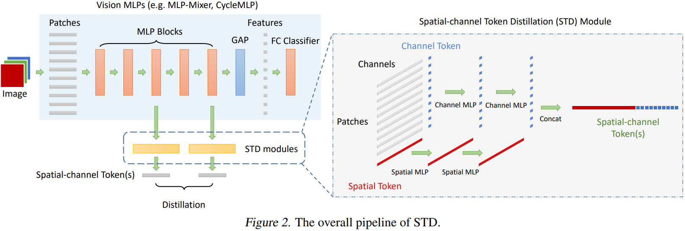

# STD


A PyTorch implementation of the paper [Spatial-Channel Token Distillation for Vision MLPs](https://proceedings.mlr.press/v162/li22c.html). This project codebase is mostly based on the codebase of [DeiT from Facebook Research](https://github.com/facebookresearch/deit) and built on top of it with according changes, additions or removals.

## Installation

For installation create the environment by executing the following cmd in the project root

```shell
conda env create -f environment.yml
```

## Training

Start training with 

```shell
python -m std.main --batch-size 128 --input-size 32 --patch-size 4 --model std-mlp-mixer --depth 8 --data-set CIFAR --data-path path/to/data --output_dir path/to/checkpoint_dir --teacher-model resnet32 resnet56
```

This will instantiate the run with last layer distillation only, to enable intermediate distillation, pass `--distill-intermediate`. The additional arguments can also be accessed, to see all arguments use the following command,

```shell
python -m std.main --help
```

## Evaluation

To evaluate a model, use the following command on appropriate model and arguments

```shell
python -m std.main --eval --resume path/to/model_folder --distillation-type none --teacher-model resnet32 resnet50 --model std-mlp-mixer --patch-size 4 --input-size 32 --data-set CIFAR --data-path path/to/dataset
```

This should give the following output for model STD-56

```
* Acc@1 76.850 Acc@5 94.170 loss 0.871
Accuracy of the network on the 10000 test images: 76.9
```

one important thing to notice here, if the model is trained with multiple-teacher setting, then you must pass `--teacher-model` argument accordingly to supply correct teacher count (all multi-teacher settings in the experiments were 2 teacher setting). Alternatively, instead of the model names you can pass anything (i.e. `--teacher-model 1 2` would work). Since this is evaluation only, instantiation of the teacher models do not take place, but this will inform the STD model to instantiate with correct layers and tokens, so that the model can be loaded correctly. 

## TODO
Taks to-do in the roadmap:

### Phase 1
- [X] MLP Mixer with STD
- [X] Implement MINE Regularization
- [X] Refactor the training params to match with the paper & refactor params from transformer models to allMLP models
- [X] Train CIFAR-100

### Phase 2
- [ ] ~~CycleMLP with STD~~
- [X] Multi-teacher implementation
- [X] Confidence reweighting term for multi-teacher setting
- [X] Last/Intermediate layer distillation
  - [ ] Implement separate tokens for intermidate-last layer distillation, which gives the best results in the paper.
- [X] Train ImageNet-1k
- [X] Compare results with the paper

## Notes

Notes for implementation.

### Notes regarding MINE Regularization implementation:

- The number of samples that MINE algorithm uses is not specified in the paper. By default, it's equal to the batch size, but an argument added in the `main.py` as `n-mine-samples` to be specified if one wish to use different sample size other than the batch size for MINE. It can be set as 0 to not apply MINE regularization on the STD tokens. 
- It is not explicitly mentioned in the paper when the MINE regularization is applied on the weights, but we assumed that it is applied after casual weight updates (training).

### Notes regarding experimental setup

- In the paper, it's stated that "_the distillation tokens are inserted 2/3 positions_". It is assumed in the implementation that they refer to every 2nd of 3rd **network block** and not a single layer (e.g. Mixer block for MLPMixer).


## Contribution

To check if codestyle pass use

```shell
python -m scripts.run_code_style check
```

To reformat the codebase use

```shell
python -m scripts.run_code_style format
```

For easier setup, you can alternatively use the conda command

```shell
conda develop <path>
```

where `<path>` is the project root folder (not the source folder).

## License

This work contains the implementation of the methodology and study presented in the 
_Spatial-Channel Token Distillation for Vision MLPs_ paper. Also as the building block of the codebase, [facebookresearch/deit](https://github.com/facebookresearch/deit) is used, modified and adapted accordingly when necessary. The work here is licensed under MIT License (extending deit repository Apache license).
