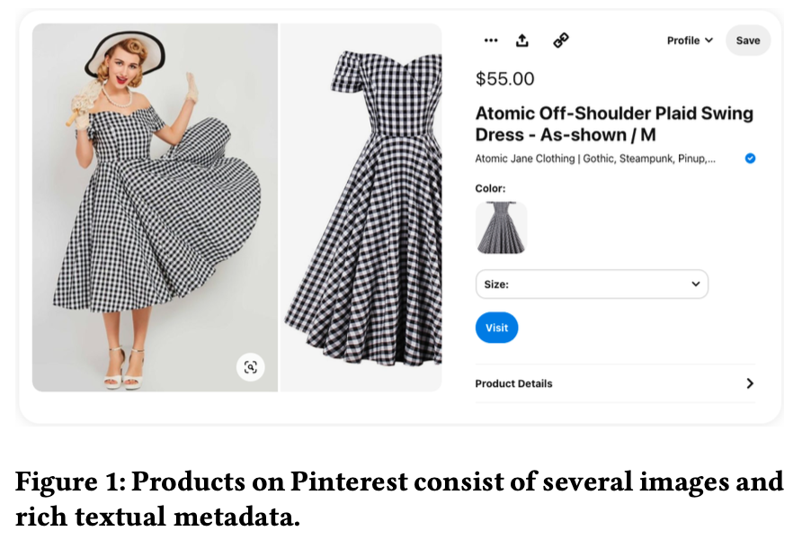
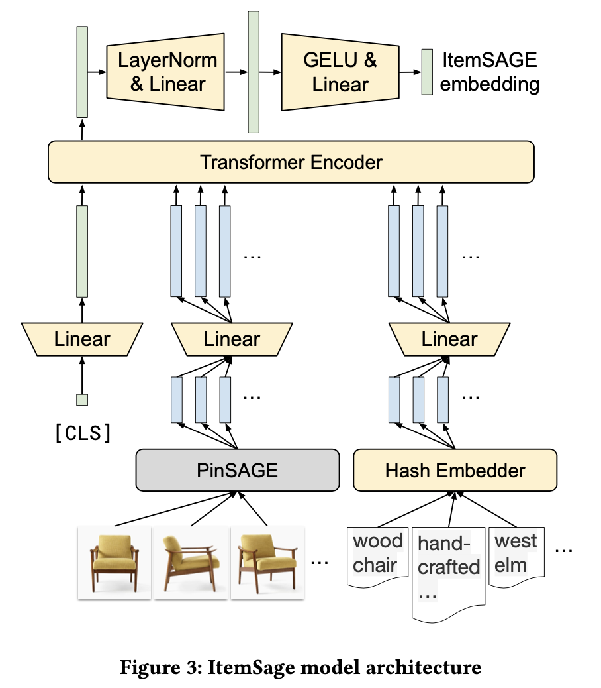

# ItemSage: Learning Product Embeddings for Shopping Recommendations at Pinterest

This README file is an outcome of the CENG502 (Spring 2023) project for reproducing a paper without an implementation. See CENG502 (Spring 20223) Project List for a complete list of all paper reproduction projects. 

# 1. Introduction

Paper is published on ACM SIGKDD Conference on Knowledge Discovery and Data Mining in 2022. It proposes a recommender system using multi-modal representation learning. Proposed system uses image and text embeddings to provide better results to Pinterest users. It creates a single embedding for each item and gained +7% improvement in key bussiness metrics.

 

 

 

## 1.1. Paper summary

Pinterest is an image-based social network. Users can search for content by text queries. System recommends contents according to their interests, log histories and also current image. In order to provide fast and effective recommendations and search results to the users, authors created a multi-modal system.  

There are 3 surfaces at Pinterest where users get recommendation according to their current context. At Home surface, users get recommendations according to their past activity. In the Closeup surface, recommendation are provided according to the pin the user currently viewing. In the Search surface, recommendations are created according to the search string. All of the surfaces use the same item embeddings. 

 

 

Each item is represented by 12 text embeddings including title, color etc and at most 20 image embeddings. Images are embedded using the PinSage module of Pinterest which is not available publicly. Texts are embedded using jointly with the system. Text are converted to numerical IDs using vocabulary. Unigrams are selected from most frequently used 200000 words, bigrams are selected from 1000000 tokens and character trigrams are selected from 64000 tokens. Out of vocabulary tokens are neglected.

 

# 2. The method and my interpretation

## 2.1. The original method

## 2.1.1. Multi-Modal Representation Learning

 
The aim of the multi-modal representation learning is to combine embeddings from different modalities including voice, vision, text etc. and create a single embedding for a product. [x] Paper propose a multi-modal representations from image and text embeddings. 

Image embeddings are taken from PinSage [1] module.  

Text embeddings are produced using hashing trick in order to get rid of high vocabulary volume. They used an embedding table E size of 100.000 x 256. And weight table W size of |V|x2 weights where V is the vocabulary size. Numerical values for each token is taken from the vocabularies. Then, hashing trick is used to get 2 embeddings for each text token. 2 embeddings are multiplied with their corresponding weigths and summed.  

The global variable CLS is passed through a linear layer.  

According to authors this is the first system that applies multi-modal representation model for production-scale recommendation systems. 

## 2.1.2. Multi-Task Representation Learning

Recommendation systems may have several tasks to be accomplished by using the same model. In order to provide this, systems employ multiple task-specific embeddings. However, using a single embedding acrross several tasks is more economic and convenient. Therefore, authors utilized a single product embedding for multi-task learning. 

## 2.1.3. Model Architecture

 

 

Authors used transformer encoders to get the relationship among embeddings. First, all embeddings including image, text and CLS are processed through a linear layer size of 512 to convert all embeddings to the same dimensions. Then, embeddings are passed through 1-layer transformer encoder. The global embedding, CLS token is used as the output of the transformer encoder. This embedding is passed through a sequential nonlinear GELU layer to obtain the 256 dimension final embedding. 
Each item is represented by this 256 dimensional embedding.  

For search through the embeddings, each item is transformed into its corresponding embedding and search is done via Approximate Nearest Neighbour Search [2].

## 2.2. Our interpretation 

 
Since, PinSage which is used for image embeddings is not available publicly, we emplyed another image embedder for this. We used ResNet50 pretrained on ImageNet as image embedder. And also we did not have most frequently used vocabularies. In  order to overcome this usage, we emplyed hashing trick in this part too. We got numerical IDs for each token by using a hash function. Hash function provided us a value which we used for getting corresponding weigths from weight table W.

Other parts are implemented as it is in the paper. 

We did not have a dataset that is used by Pinterest which has around 20 photos per item. So we used amazon dataset, and try to train the model but could not manage to finish it. A sample run is included in the code file.

# 3. Experiments and results

## 3.1. Experimental setup

@TODO: Describe the setup of the original paper and whether you changed any settings.

## 3.2. Running the code

@TODO: Explain your code & directory structure and how other people can run it.

## 3.3. Results

@TODO: Present your results and compare them to the original paper. Please number your figures & tables as if this is a paper.

# 4. Conclusion

@TODO: Discuss the paper in relation to the results in the paper and your results.

# 5. References

[1] Rex Ying, Ruining He, Kaifeng Chen, Pong Eksombatchai, William L Hamilton, and Jure Leskovec. 2018. Graph convolutional neural networks for web-scale recommender systems. In Proceedings of the 24th ACM SIGKDD International Conference on Knowledge Discovery & Data Mining. 974–983.

[2] Yen-Chun Chen, Linjie Li, Licheng Yu, Ahmed El Kholy, Faisal Ahmed, Zhe Gan, Yu Cheng, and Jingjing Liu. 2019. Uniter: Learning universal image-text representations. (2019).

[x] Wenzhong Guo, Jianwen Wang, and Shiping Wang. 2019. Deep multimodal representation learning: A survey. IEEE Access 7 (2019), 63373–63394.

* All pictures and figures are taken from original paper.
  
# Contact

@TODO: Provide your names & email addresses and any other info with which people can contact you.
