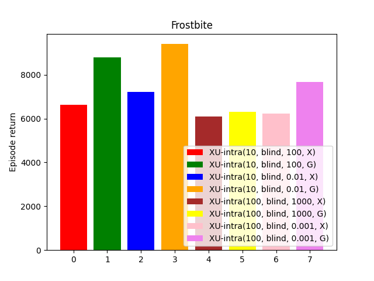

# When Should Agents Explore?

This readme file is the outcome of the [CENG502 (Spring 2023)](https://ceng.metu.edu.tr/~skalkan/ADL/) project for reproducing a paper's results.

# 1. Introduction

This is an unofficial PyTorch implementation of the ICLR'22 spotlight paper "When Should Agents Explore?" [1].

The aim of this repository is to reproduce the results of the paper by implementing the code from scratch in PyTorch, to train on the same dataset by using the details described in the paper, and to try to obtain a similar performance.

## 1.1. Paper summary

In reinforcement learning (RL), the trade-off between exploration and exploitation is a long-standing challenge. When an RL agent is in exploration mode it takes an uninformed action whereas in exploitation mode, the agent chooses the best action based on its past experience. The standard approach is to use an \epsilon-greedy policy where the agent performs a random action with a small probability (e.g. $0.001$) and otherwise executes the best action using its Q-function that collects information as the agent experiences the environment. This paper tackles the problem of choosing when to enter exploration mode and when to stay in exploitation mode. 

The paper proposes several strategies for selecting between exploration and exploitation. The authors try to answer the following questions: 
* At which timestep should the agent enter exploration mode?
* How long should the exploration take?
* Is performing a single-step exploration better or taking exploratory actions for a period better?
* What is the effect of probabilistic (blind) switching versus informed switching?

# 2. The method and reproduction details

The paper proposes and tests multiple strategies to answer the questions outlined above. A summary of these strategies can be found in Fig.1.

<figure>
  <p align="center">
    
  </p>
  <figcaption><b>Figure 1:</b> General structure of the strategies to switch between exploration and exploitation modes identified in the paper.</figcaption>
</figure>

## 2.1. The original method

In Fig.1, the blue color represents when the agent is in exploit mode and the magenta color represents the times during which the agent is in exploration mode. The first strategy (A) is the extreme case where the agent is always in exploration mode. In B, the agent alternates between exploration and exploitation selected at the beginning of each episode. Strategy C is the $\epsilon$-greedy approach where the agent selects an exploratory action intermittently. Strategies D and E focus on performing exploratory actions in bursts of fixed length with the difference being the first time the agent enters the exploration mode while F allows for different lengths of exploration bursts. G is a completely different strategy that focuses more on exploration than exploitation.

However, these strategies alone do not answer the questions above well. Therefore, to formalize these definitions, the authors come up with several descriptors.

* Blind vs Informed switching: Whether to switch modes blindly or by considering a metric to measure how effective the current strategy is.
* Explore mode: Describes how to pick an action during exploration mode. The first is to select uniform randomly which is a common strategy and secondly choose based on intrinsic motivation using Random Network Distillation [2].
* Exploration/Exploitation duration: These can either be fixed duration or the time to enter/exit modes can be selected randomly with a given probability or even the probability with which to enter/exit can be chosen using a multi-armed bandit [3, 4].
* Start mode: Whether to start each episode from exploration mode or the exploitation mode.

The paper uses a common distributed reinforcement learning agent named R2D2 [5] a variant of DQN [6] in their experiments. This agent uses a recurrent network to calculate its Q-value. The most important modification applied to this agent is the exploration mechanism. The authors test this idea on 7 games from the popular Atari Learning Environment (ALE) [7].

The convention used by the paper to describe each of the aforementioned modes can be found in Fig.2.

<figure>
  <p align="center">
    
  </p>
  <figcaption><b>Figure 2:</b> Intra-episodic exploration parameter descriptions and the naming conventions used in the paper illustrated over a single episode.</figcaption>
</figure>

## 2.2. Our Interpretation

All in all, the paper explained many details regarding every aspect of the work. However, there were some aspects that we found to be missing especially the ideas that were borrowed from other papers. 

The details regarding the informed switching and homeostasis algorithms were missing. Still, an equation for informed switching and an algorithm for homeostasis was presented but there was not enough information as there were some hyperparameters missing. Informed switching is based on the value promise of a past state. Meaning that the agent would check $k$ steps back from its current state and determine how much reward it hoped to get starting from the state and compares it with the reward it obtained between. However, the $k$ value used for this purpose was missing. Additionally, the homeostasis algorithm is used as a normalization method for informed switching as the magnitude of the rewards varies across games and reward densities. Homeostasis generates an on-the-fly boundary to switching using recent values of the signal (value promise). Again, how much of the history was used in this case was not explained and we opted to use half of the history until that state. 

# 3. Experiments and results

## 3.1. Experimental setup

Most of our experimental limitations were due to computation budgets. For example, the paper used $120$ actors whereas we used $8$ actors. Our overall training budget is also much smaller. The paper used 2B environment frames while we only had 50M. The paper presented results for $7$ games with some of the results in the appendix. We only used a single game, namely, Frostbite to reproduce the results whose results were all presented in the main paper rather than the appendix. Finally, we have used a single seed to produce our results with the paper using $3$ seeds to average the results.

As there were no details regarding the bandit algorithm and the RND implementation with only references pointing to papers, we were not able to implement them. Instead of RND, we only present our results with a uniform random selection of actions during exploration mode, granted the paper's results using RND are lower in all cases for the Frostbite game. Instead of the bandit algorithm, we used a fixed probability (with 2 different values) with which the agent switches to exploration mode. 

## 3.2. Running the code

Our codebase is structured as depicted below:

```
.
├── resources/ (Image files)
├── actor.py (Actor/agent implementation with decisions regarding exploration/exploitation mechanisms)
├── config.yml (Configuration file containing all hyperparameters)
├── environment.py (Environment generation utilities for Atari games)
├── environment.yml (Packages required for creating a conda environment)
├── learner.py (Learner that performs the training steps)
├── local_buffer.py (Local buffer implementation, a smaller replay buffer)
├── priority_tree.py (Priority tree implementation used for sampling from the replay buffer)
├── r2d2.py (R2D2 model implementation)
├── replay_buffer.py (Replay buffer implementation used for storing past experience)
├── requirements.txt (Minimum requirements for running the code)
├── test.py (Main file for running evaluation)
├── train.py (Main file for running training)
└── README.md (The main readme file)
```

1. Create a conda virtual environment and activate it.

    ```shell
    conda env create -f environment.yml
    conda activate env_name
    ```

2. For training, simply set the settings from the ```config.yml``` file and run:

    ```
    python train.py
    ```

3. For evaluation, the directory should contain a ```models/``` folder consisting of the many checkpoints stored during training. Simply running the following command would generate a plot showing the agent's progress during training.

    ```
    python test.py
    ```

## 3.3. Results

In this part, the evaluation results for our implementation are given. To illustrate the differences between various switching approaches, we produced Figure 3, Figure 4, Figure 5, Figure 6, and Figure 7 which are also given in the paper and are respectively named Fig. 3, Fig. 4, Fig. 5, Fig. 6, and Fig. 7.

In the paper, the authors do experiments on various games and take the mean-median scores belonging to each game type. Since we did our experiments on only the Frostbite game, Fig. 3 does not contain mean and median values. Similar to the paper, the worst performance belongs to the case where we use a pure explore mode for the entire experiment denoted by XU-experiment-level-X. Interestingly, randomly switching between explore/exploit modes at the start of each episode provides the highest score here (color red), beating the most commonly used epsilon-greedy strategy illustrated with the color green. Finally, we see our informed switching variant fails to match the scores in the paper. We believe this may have been because there was some missing information regarding informed switching and we are using a fixed probability for switching rather than a bandit algorithm.

<br>

<center>

Our Results             |  Original Results
:-------------------------:|:-------------------------:
 | 

<b>Figure 3:</b> Human-normalized performance results for the Frostbite game. The average rewards are divided by a human performance score which is 4335 for Frostbite.

</center>

<br>

Fig. 4. compares and contrasts the different approaches. We have 6 approaches in total. In all 6 cases, explore/exploit ratio is kept around 1:10. The first number in the parentheses indicates the explore mode duration. The second item in the parentheses describes the mode of switching. The third item describes the target rate for informed switching or the probability of switching to explore mode (tried values: 0.01, 0.001) and the duration of exploration (tried values: 10, 100). The final item is the mode with which each episode starts. In this case, all different approaches use exploitation mode to start. Our maximum numbers are lower than what is presented in the paper due to our limited computational budget however, we see that probabilistic switching provides a benefit compared to switching fixed intervals for the entire training. This stochasticity allows the model to explore/exploit in different states as opposed to maybe getting to the explore mode at the same state each time. Unfortunately, our informed switching results do not match that of the paper but our blind switching mechanisms come very close and display a similar pattern.

<br>

<center>

Our Results             |  Original Results
:-------------------------:|:-------------------------:
 | 

<b>Figure 4:</b> Final scores of different approaches. The final scores are calculated by taking the maximum of the rewards.

</center>

<br>

Fig. 5. compares informed switching and blind switching. During the early stages of training, informed switching outperforms blind switching. However, the performance falls off after half the training is complete. We again explain these results with the missing details regarding the bandit and homeostasis algorithms. 

<br>

<center>

Our Results             |  Original Results
:-------------------------:|:-------------------------:
 | 

<b>Figure 5:</b> The learning curves illustrate that informed triggers helped the actor to reach high scores quickly.

</center>

<br>

In Fig. 6., we experiment with the effect of the start mode. The paper only shows 2 cases per game but we show 4 different cases for Frostbite. Interestingly, for Frostbite, starting each episode with exploration leads to the agent performing consistently worse across all strategies. This may be due to the earlier steps in Frostbite being more important to get a good position in the late game.  

<br>

<center>

Our Results             |  Original Results
:-------------------------:|:-------------------------:
 | 

<b>Figure 6:</b> The bar plot shows that for all cases the greedy variant achieves better results compared to the exploit variant.

</center>

<br>

Fig. 7. compares our probabilistic switching method with the fixed duration switching. The probabilistic switching achieves a higher maximum return value but is noisier.

<br>

<center>

Our Results             |  Original Results
:-------------------------:|:-------------------------:
 | 

<b>Figure 7:</b> For the given performance curves, the behaviors are similar for step-based and probability-based approaches. The highest score is achieved when the probability-based variant is used.

</center>

# 4. Conclusion

In conclusion, our overall results show a similar pattern that is presented in the paper. One discrepancy we found here was regarding informed switching. We believe this may be due to the missing parameters that we discussed in Section 2.2. Also, our results are below the original paper's results in terms of episode return. We believe this was because our computing budget was limited and if the training were to continue, we could have reached those values. Still, in general, we see that our results are promising, given enough processing power, these results can match the results given in the paper. Lastly, we also presented some additional ideas in place of the bandit algorithm which improved the results compared to blind fixed duration switching. 

# 5. References

1. M. Pîslar, D. Szepesvari, G. Ostrovski, D. Borsa, and T. Schaul. When should agents explore? In International Conference on Learning Representations, 2022.
2. Yuri Burda, Harrison Edwards, Amos J. Storkey, and Oleg Klimov. Exploration by random network distillation. CoRR, abs/1810.12894, 2018.
3. Tom Schaul, Diana Borsa, David Ding, David Szepesvari, Georg Ostrovski, Will Dabney, and Simon Osindero. Adapting behavior for learning progress, 2019.
4. Adrià Puigdomènech Badia, Bilal Piot, Steven Kapturowski, Pablo Sprechmann, Alex Vitvitskyi, Daniel Guo, and Charles Blundell. Agent57: Outperforming the Atari human benchmark, 2020a.
5. Steven Kapturowski, Georg Ostrovski, Will Dabney, John Quan, and Remi Munos. Recurrent experience replay in distributed reinforcement learning. In International Conference on Learning Representations, 2019.
6. Volodymyr Mnih, Koray Kavukcuoglu, David Silver, Andrei A. Rusu, Joel Veness, Marc G. Bellemare, Alex Graves, Martin Riedmiller, Andreas K. Fidjeland, Georg Ostrovski, Stig Petersen, Charles Beattie, Amir Sadik, Ioannis Antonoglou, Helen King, Dharshan Kumaran, Daan Wierstra, Shane Legg, and Demis Hassabis. Human-level control through deep reinforcement learning. Nature, 518(7540):529–533, 2015.
7. Marc G Bellemare, Yavar Naddaf, Joel Veness, and Michael Bowling. The arcade learning environment: An evaluation platform for general agents. Journal of Artificial Intelligence Research, 47:253–279, 2013.

# 6. Acknowledgments

The paper relies on the R2D2 model. Therefore, we took some inspiration from several R2D2 implementations for the agent's implementation whose links can be found below:
- https://github.com/Coac/never-give-up
- https://github.com/ZiyuanMa/R2D2/
- https://github.com/seungju-mmc/Distributed_RL
- https://github.com/g6ling/Reinforcement-Learning-Pytorch-Cartpole/

# Contact

- Can Ufuk Ertenli
    - ufuk.ertenli -at- metu dot edu dot tr
    - [Github](https://github.com/ufukertenli)

- Onat Özdemir
    - onat.ozdemir -at- metu dot edu dot tr
    - [Github](https://github.com/oonat)
