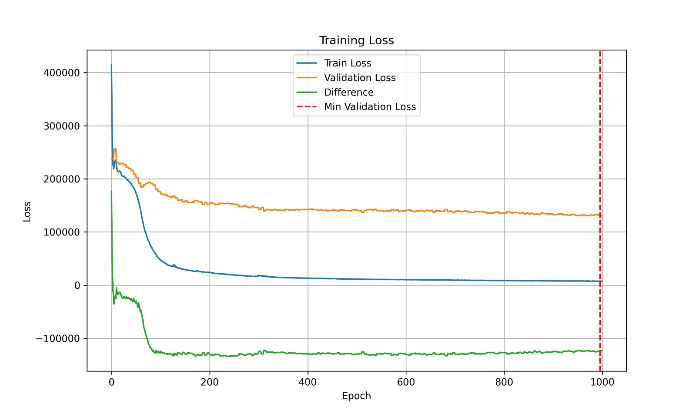
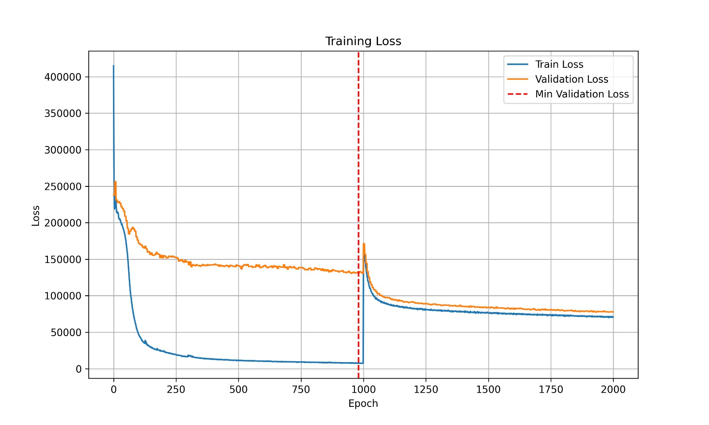

# TUNEUP: A TRAINING STRATEGY FOR IMPROVING GENERALIZATION OF GRAPH NEURAL NETWORKS

  

This readme file is an outcome of the [CENG502 (Spring 2023)](https://ceng.metu.edu.tr/~skalkan/ADL/) project for reproducing a paper without an implementation. See [CENG502 (Spring 20223) Project List](https://github.com/CENG502-Projects/CENG502-Spring2023) for a complete list of all paper reproduction projects.

  

# 1. Introduction

  

[TUNEUP](https://openreview.net/pdf?id=8xuFD1yCoH)[^tuneup], authored by [Weihua Hu](https://scholar.google.co.jp/citations?user=wAFMjfkAAAAJ&hl=ja), [Kaidi Cao](https://scholar.google.com/citations?user=4Zw1PJ8AAAAJ&hl=en),[Kexin Huang](https://scholar.google.com/citations?user=ogEXTOgAAAAJ&hl=en), [Edward W Huang](https://scholar.google.com/citations?user=EqvdkCAAAAAJ&hl=en), [ Karthik Subbian](https://scholar.google.com/citations?user=6ai0lDAAAAAJ&hl=en), and [Jure Leskovec](https://scholar.google.com/citations?user=Q_kKkIUAAAAJ&hl=en) is submitted to ICLR 2023. This paper proposes a novel method to employ a curriculum learning strategy on Graph Neural Networks (GNNs) for both inductive and transductive settings to alleviate a common problem: the neglect of nodes with lower degrees (tail nodes). That is, the classical simplistic loss for GNNs focuses on the easier task, optimizing the loss over the nodes with higher degrees (head nodes), and overlooks the nodes with low degrees (tail nodes), which are essentially harder to predict. This, overall, results in suboptimal performance. To mitigate this, they propose a curriculum learning strategy with essentially two stages: (1) train the model for the easy task (performing well on head nodes), and (2) adapt this model to the harder task (performing well on tail nodes).

  

## 1.1. Paper summary

  

TUNEUP uses a two-stage training strategy to train a GNN: initially employing the default training strategy, then transferring the learned model to train specifically for the tail nodes. For the first stage, the base GNN simply minimizes the given supervised loss, which is likely to perform well on head nodes while poorly on tail nodes. In the second stage, TUNEUP synthesizes many tail nodes by dropping edges. And, by reusing the supervision from the dropped edges, the base GNN is finetuned to perform well on the tail nodes.

  

The paper addresses three main graph learning problems: semi-supervised node classification, link prediction, and recommender systems. In the context of this project, we focused on the link prediction task.

  

*Link Prediction Task:* Given a graph, predict new links. That is, given a source node, predict target nodes.

*  *Graph* $G$

*  *Supervision* Y: whether node $s \in V$ is linked to a node $t \in V$ in $G$

*  *GNN* $F_{\theta}$: GNN model that predicts the score for a pair of nodes: $(s,t) \in V x V$, by generating the embeddings of $s$ and $t$ and calculating a score for their concatenation using an MLP.

*  *Prediction*: $Y'$

*  *Loss* L: [The Bayesian Personalized Ranking (BPR) loss](https://arxiv.org/abs/1205.2618) [^bpr], a contrastive loss to increase the scores for positive node pairs compared to negative ones.

  

*Below is the pseudocode of the overall TUNEUP Method*

Given: GNN Fθ, graph G, loss L, supervision Y, DropEdge ratio α.

  

1: # First stage: Default training to obtain a base GNN.

2: while θ not converged do

3: Make prediction Y' = Fθ(G)

4: Compute loss L(Y , Y'), compute gradient ∇θL, and update parameter θ.

5: end while

  

6: # Second stage: Fine-tuning the base GNN with increased tail supervision.

7: while θ not converged do

8: Synthesize tail nodes, i.e., randomly drop α of edges: G DropEdge −−−−−−→ G'.

9: Make prediction Y' = Fθ(G').

10: Compute loss L(Y , Y'), compute gradient ∇θL, and update parameter θ.

11: end while

  

  

# 2. The method and my interpretation

  

## 2.1. The original method

The paper proposes a method called TuneUp. Training of a backbone network is divided into 2 parts. The first part is default GNN training, the second part is where edges are dropped from training edges to "simulate" tail nodes. There are also ablation parts where the effects of different combinations of the approach can be observed. In the following subsections, the main approach and these ablation approaches are described. Since we focused on link prediction, these are *explicitly exclusive* definitions for link prediction.

  

### 2.1.2 Default GNN Training

  

This task is to train a baseline GNN, performing well on head nodes with high degrees. For a given graph $G$, utilizing a Graph Neural Network, the embeddings of node pairs, forming edges, are attained. Then, the embedded node pairs are fed to an MLP to arrive at a score. For this, GraphSAGE [^SAGE] and GCN networks are used in the paper. All training edges are treated as positive edges and given to GNN as a graph. In loss propagation, this information is used as an inherent supervision ie, we have both positive and negative samples.

  

  

### 2.1.3 Tune Up

Tune Up proposes to do additional training on top of an already trained network with the default GNN training approach. In Tune Up, according to the chosen edge drop ratio training edges are dropped from the graph. Thus, GNN is not able to message pass using these edges, essentially, generating pseudo-low-degree, hard-to-learn nodes. However, in loss calculation, the model utilizes these removed edges as positive edges for backward propagation. With this approach, the network is pushed towards learning to message passing with a limited amount of edges, or in other words, the network learns to handle nodes with low degrees, tail nodes.

  

### 2.1.4 w/o curriculum

In TuneUp, first, the GNN is trained with all of the available training edges, thus trained on a high density of "head" nodes. In other words, easy-to-learn nodes. In the second part of the training, with the removal of the edges, more tail -harder to train- nodes are generated. Thus, it creates a "curriculum" type of training. In w/o curriculum study, the network simultaneously learns with easy-to-learn and hard-to-learn nodes. A comparison of this with TuneUp shows the effectiveness of the curriculum approach.

  
  

### 2.1.5 w/o syn-tails

In w/o syn-tails, edge drop is not applied in the second stage of the training. This is essentially further training of the network with the same data. This ablation study is done to observe the effect of generating syn-tails on the learning of the GNN.

  

## 2.2. Our interpretation

  

The TUNEUP methods' description is really clear within the paper, we apply the same algorithm for training the network. However, [referenced paper's](https://github.com/DropEdge/DropEdge/tree/master) implementation of the drop edge does not directly apply to the dataset at hand, so we have reimplemented it.

  

The most ambiguous part of the paper is on data splits, training, and testing of the network. So we did a lot of guesswork there. The following subsections follow this guesswork.

  

### 2.2.1 Data Sources

Our initial plan was to implement the PPI dataset for the paper. However, referenced paper for the dataset doesn't mention the dataset once and we couldn't find any repository having the dataset from that paper. Investigating the [arxiv page](https://arxiv.org/abs/2210.14843) of the paper, a [papers with code site link](https://paperswithcode.com/dataset/ppi) is given. Following the link a dataset named ppi can be found from [torch geometric's site](https://pytorch-geometric.readthedocs.io/en/latest/generated/torch_geometric.datasets.PPI.html#torch_geometric.datasets.PPI). However, we observed that the number of nodes and edges were not matching with the specifications on the paper. Also, protein ids and the corresponding amino acid sequences were missing from the dataset. Without the sequences and the ids, we were unable to embed them with the ESN language model. We e-mailed the first author of the paper about the dataset, however, we couldn't get any response in 1 month.

  

After this mismatch with dataset size and missing contextual data, we decided to pursue the ogbn-arxiv dataset. However, the same mismatch occurred. In the paper node size is reported as 143,941, however, the dataset we have found has 169,343 nodes, indicating a different dataset or filtering. However, we couldn't find any explicit reference to this event. In the current version, we are using the mismatched version. We hypothesize that authors filtered the dataset to reach their version.

  
  

### 2.2.1 Data Split

As it is graph data, the split happens in two parts: the splitting of the nodes and edges. Even though each part's split is detailed, their interaction was not clear.

  

*Nodes*

  

All of the nodes are divided into 2 parts. V, 95%, to be used in training, validation, and testing for the transductive part. V_new, 5%, will be used in the testing of the inductive part.

  

*Edges*

  

Edges are divided into 2 parts. E_training, 50%, is used in the training of the network for both transductive and inductive tasks. E_validation, 50%, used in validation and testing for both inductive and transductive tasks.

  

*Parts Interaction*

It is not clear how these edges and nodes fit together for the inductive part. If chosen independently from each other, there is a possibility that we won't have any edges in-between V_new in E_validation. Meaning that inductive testing wouldn't be possible. Though this is a small chance, it shows that the initial conditions of the splits are of high importance. We didn't apply any normalization on the distribution of the edge splits on node splits. We split the data according to the exact specifications given in the paper, even though we know these specifications are not enough to have a non-biased dataset.

  

### 2.2.1 Training Spesifications

  

*Negative edge ratio in training*

  

In the calculation of loss, bpr loss is used. Predictions of the model on positive and negative edges are used to propagate backward. The ratio of positive and negative samples is crucial for the learning style and speed of the network. However, no ratio is explicitly mentioned in the paper. We assumed this ratio to be 1. We feed equal amounts of positive and negative edges to the BPR loss.

  

*Early Stop*

  

It is explicitly stated that early stopping is utilized. However, it is not clear, how it was implemented: patience levels, etc. Not to hassle with this issue, we train the model on the whole 1000 epochs as stated in the paper, saving them periodically at certain points, and choose the one with the lowest validation loss.

  
  

*Hyperparameters*

  

The paper mentions that they tried 0.25, 0.50, and 0.75 for drop edge ratio for transductive link prediction. However, they don't mention which one was the best option. We have chosen our drop edge ratio as 0.50. Meaning that every 1 edge out of 2 is removed according to the given drop edge method.

  

### 2.2.2 Testing Spesifications

  

*Recall calculation method*

The paper mentions that they use Recall@50 for the evaluation of the network. However, there is no explicit implementation. That's why we used the implementation in [referenced paper](https://arxiv.org/abs/1905.08108) [^filter], here is [the implementation](https://github.com/xiangwang1223/neural_graph_collaborative_filtering/blob/a718a4f2df7c3942ca0df6759926975762c61eed/NGCF/utility/metrics.py#L73). Implementation's paper is referenced next to the recall in TuneUp's paper.

  

*Recall calculation negative edge count & Amount of nodes used for recall calculation*

  

In recall calculation, it is possible to produce about ~160,000 negative synthetic edges for each node. There are about ~80,000 nodes in for validation. Resulting in a ~13 x 10^9 combination. Due to the limited time and resources we have, 40,000 randomly selected nodes from validation and 40,000 negative synthetic edges for each node were used.

  

### 2.2.2 Model

  

In the backbone model, the decoder part is mentioned as MLP, without any further specification. We assumed 2 layers deep MLP with 256 hidden dimension size.

  
  

# 3. Experiments and results

  

## 3.1. Experimental setup

  

There are three tasks reported in the paper: semi-supervised node classification, link prediction, and recommender systems. They have used 3 different datasets to evaluate the performance of TUNEUP on the link prediction task: ppi, Flickr, and ogbn-arxiv. As per the time limits and lack of computing power we have access to, we have chosen to focus on the link prediction task using only the [ogbn-arxiv](https://ogb.stanford.edu/docs/nodeprop/) dataset.

For link prediction, the paper reports results on three datasets: ppi (protein-protein interaction), Flickr, and arxiv (paper citation) networks. For semi-supervised node classification, they use ogbn-arxiv and ogbn-products networks. And, for the recommender system task, which is essentially a link prediction between bipartite graphs, they report scores on gowalla, yelp2018, and amazon-book datasets. 

In the transductive setting, the goal is to make predictions on the data already on the graph. For the link prediction task, for example, it predicts the existence of edges between the nodes in the graph the model is trained with. In an inductive setting, however, the goal is to assess the performance on data never seen during training, ie, for link prediction, it is to predict the existence of an edge between two nodes that were not present in the training data. For this, before training, a small set of nodes is separated from the training graph. For the inductive cold setting, a portion of the edges is randomly removed, simulating a scenario for the tail nodes with pseudo-supervision. In this way, the subgraphs with an elevated number of tail nodes are fed to the graph while keeping the ground truth information at hand.    

  

The below table shows the different experimental setups for the link prediction task with ogcn-arxiv dataset using different methods.

  

<!-- PUT &#9745 for checks -->

| Method                         | Transductive (ours) | Inductive (ours) | Inductive Cold 30%  (ours) | Inductive Cold 60% (ours) | Inductive Cold 90% (ours) |
| ------------------------------ | :----------: | :-------: | :----------------: | :----------------: | :----------------: |
| Base                           |   &#9744;    | &#9744;   |     &#9744;        |     &#9744;        |     &#9744;        |
| TUNEUP w/o curriculum          |   &#9744;    | &#9744;   |     &#9744;        |     &#9744;        |     &#9744;        |
| TUNEUP w/o syn-tails           |   &#9744;    | &#9744;   |     &#9744;        |     &#9744;        |     &#9744;        |
| *TUNEUP (ours)*              |   &#9744;    | &#9744;   |     &#9744;        |     &#9744;        |     &#9744;        |

<b>Table 1: Experimental setup presented in the paper for the link prediction task (Regenerated according to data in the paper, borrowed)</b>

  

*Hyper-parameters*

  

The following are the hyperparameters explicitly stated within the paper for the link prediction task:

* 3-layer GNN

* Hidden dimensionality: 256

* L2 regularization on node embeddings

* Number of epochs for both default training and finetuning is 1000

* learning rate = 0.001

  
  

We utilized precomputation a lot during the implementation. Thus, start-up time can take around 10 minutes.

  

## 3.2. Running the code

### 3.2.1 Directory

The directory consists of 2 main folders.

`bin:` Holds all py documents that are used by `train_controller` class.

`dataset:` Empty in the repository. While `train_controller` initializing it fills it with ogbn dataset.

`figs:` Holds the figures used in this readme file

`bin:`
- `train_controller.py:` Main class for the implementation. Controls all processing and training.
- `data_processor.py:` Helper class to `train_controller`, downloads dataset, preprocesses and splits data
- `models.py:` Holds graphical convolutional network
- `utils.py:` Helper functions
- `TuneUp.py:` Parser for command line interface
  
### 3.2.2 Running the TuneUp 

Execute the `TuneUp.py` script using Python with the following syntax:

shell
python TuneUp.py TMN mode [options]

Here, `TMN` is the trained model name, and `mode` is the mode you want to run. You can also specify additional options to customize the experiment:

- `--training_type {X}`

    Training type.
    Choose between 'base', 'tuneup', 'wo_syn', 'wo_cur'.
    Default is 'base'.

- `--test_type {X}`

    Test type.
    Choose between 'transductive', 'inductive'.
    Default is 'transductive'.

- `--epoch {X}`

    Number of epochs.
    Any positive integer.
    Default is 1000.

- `--lr {X}`

    Learning rate.
    Any positive float.
    Default is 0.0001.

- `--weight_decay {X}`

    Weight decay.
    Any positive float.
    Default is 0.001.

- `--drop_percent {X}`

    Drop percent.
    Any float between 0 and 1.
    Default is 0.5.

Example queries:

shell
python TuneUp.py my_trained_model train --training_type base --epoch 500 --lr 0.001 --weight_decay 0.01 --drop_percent 0.3

shell
python TuneUp.py my_trained_model test --test_type inductive --epoch 300 --lr 0.0005 --weight_decay 0.002 --drop_percent 0.4

shell
python TuneUp.py my_trained_model train --training_type tuneup --lr 0.0002 --weight_decay 0.005

`WARNING` It priotizes MPS > CUDA > CPU.

### 3.2.3 Running Times

Any kind of testing and training was painstakingly slow in tried CPUs (M1) and Intel(R) Core(TM) i5-8265U CPU @ 1.60GHz 1.80 GHz.

Using the MPS of the M1 didn't do any favor.

We used Colab for attaining the results. Mainly, V100 and A100. With these GPUs per epoch is around 6 seconds, leading to 3 hours of training time for 2000 epochs (training and finetuning).

For testing of the trained models, 40,000 nodes with 40,000 generated synthetic negative edges take around 4 hours.

Expected results are dependent on the model and parameters used in the command.

  

## 3.3. Results

### 3.3.1. Implementation Results
The following figures show the train and loss plots of different settings: baseline and tuneup. The former is the baseline training of the model on 1000 epochs, whereas, the latter is the finetuned model using the TUNEUP method. Redlines are indicating epochs with the best validation loss in default training.

<b>Figure 1: The train and validation loss curves of the baseline model we implement (Our result)</b>

<b>Figure 2: The train and validation loss curves of the TUNEUP method we implement combining both pretraining and finetuning (Our result)</b>

Below, we report the Recall@50 results for several tests of the baseline model on the transductive link prediction task:

| BASELINE | TEST 1 | TEST 2 | TEST 3 | TEST 4 | AVG |
| -------- | ----- | ----- | ----- | ----- | --- |
|     Recall@50     | 0.103 | 0.132 | 0.126 |  0.127 | 0.122 |

<b>Table 2: The evaluation of our baseline model on transductive link prediction tasks on multiple runs. (Our results)</b>

 Method                         | Transductive | Inductive  | Inductive Cold 30% | Inductive Cold 60% | Inductive Cold 90% |
| ------------------------------ | :----------: | :-------: | :----------------: | :----------------: | :----------------: |
| Base                           |   0.122    | 0.090  |   -       |   -       |    -        |
| TUNEUP w/o curriculum          |   0.130    |  -   |     -        |     -       |     -        |
| TUNEUP w/o syn-tails           |   0.112    | 0.096   |   -        |     -        |    -        |
| *TUNEUP (ours)*              |   0.147    | 0.125   |     -       |     -       |    -        |

<b>Table 3: The evaluation of our implementation of the baseline, TUNEUP w/o curriculum, TUNEUP w/o syn-tails, and TUNEUP methods on transductive and inductive settings (Our results)</b>

### 3.3.2. Paper Results

The below table reports the experimental results in the paper for the link prediction task under different settings and methods.

| Method                         | Transductive (Paper's) | Inductive (Paper's) | Inductive Cold 30%  (Paper's) | Inductive Cold 60% (Paper's) | Inductive Cold 90% (Paper's) |
| ------------------------------ | :----------: | :-------: | :----------------: | :----------------: | :----------------: |
| Base                           |   0.215    | 0.207  |   0.17       |   0.119        |    0.037        |
| TUNEUP w/o curriculum          |   0.234    | 0.216   |     0.185        |     0.135       |     0.055        |
| TUNEUP w/o syn-tails           |   0.219    | 0.212   |   0.17        |     0.119        |    0.036        |
| *TUNEUP (ours)*              |   0.241    | 0.225   |     0.193       |     0.144       |    0.062        |

<b>Table 4: The evaluation of the baseline, TUNEUP w/o curriculum, TUNEUP w/o syn-tails, and TUNEUP methods reported in the paper (Regenerated according to paper, borrowed.)</b>

## 3.4. Discussion

### 3.4.1 Discussion on Results
For the Baseline loss, in Figure 1, we see a constant drop in both the train and validation loss curves, though not much. However, this still suggests the model is still learning and there is no reason to employ early stopping here. 

For the TuneUp loss, Figure 2 shows that there is a distinct jump after the Default training. This is due to the drop edge and hence the change in the node embeddings. After the drop edge, the model is fed with a subset of its original edges, producing different embeddings. Further, while the decoder is learning to decode from these new embeddings, the scoring function needs to find optimal parameters to predict the score for each (source, target) node embedding, ie, edge. The result of this score is to directly predict the existence of that particular edge. That is, the change in the embeddings of the fed edge index poses a new challenge to the model in that it needs to learn to decode and score new embeddings. That is, we would expect to see an increase in the loss right after finetuning, which is in line with the produced results. Right after the 1000th epoch, we see a convergence, suggesting the proposed method, DropEdge, works fine.

Again, looking at the TuneUp loss graph we can observe a decrease in the validation loss curve right after starting the fine-tuning with edge drop. This implies that we were able to implement Tune Up to some extent.

Looking at the test measurements on the same model with default training, we can see that the value of the recall is highly volatile. This is due to the fact that we are measuring 40,000 nodes' recall out of 80,000 nodes. With each random different sampling, there is a likeliness to diverge from the mean, real value. This volatility is the most unreliable part of this implementation. However, with proper computing power, all of the nodes can be evaluated, and real recall value can be calculated rather than this sampling approach.

Comparing the results in Table 3, w/o syn and baseline GNN, an unexpected trend is observed: further finetuning of the baseline decreases the recall score (from .122, to .112). This is due to our tests' volatility caused by not measuring the recall for all nodes.

Looking at Table 3, Inductive results we see that is worse compared to transductive results. This was expected. This is due to the model performing worse on unknown nodes.

### 3.4.2 Comparison between Paper and Implementation

Comparing the results between the paper and our implementation(Table 3 - 4), it is visible that the implementation underperforms the paper. This can be due to any one of the reasons mentioned in our interpretation section.

One of the main reasons for this disparity can be the difference in the dataset. Looking at the number of nodes and average degree of nodes given in the paper and the dataset used in the implementation, it is clear that, the dataset went through some filtering/curation. This curation can be one of the reasons.

The negative edge ratio is an important factor in training, choosing a small number can inhibit, or slow down the model's ability to learn. Meanwhile, choosing a large number can be overwhelming for positive pairs and also introduce wrong labeling on unknown true pairs. Since this ratio is not reported in the paper, this difference in the implementation can be the reason. However, achieving minimum validation loss in low epochs compared to the maximum given by the paper doesn't indicate slow learning.

One of the most crucial hyperparameters of the TuneUp is the drop edge ratio and the final drop edge ratio used in the chosen models is not shared in the paper. Essentially, Tune Up is a drop-edge with a curriculum learning approach. The selection of drop edge ratio, determines the second training set's population distribution, changing the course of training. We have chosen the drop edge ratio as 0.5 without any hyperparameter tuning, this might be a reason for the decrease in model performance.

### 3.4.3 Discussion on the method and paper

Tune Up proposes a basic but neat way to increase the prediction capabilities of GNNs. Similar to the long tail distributions, where approaches try to enhance prediction metrics of tailing classes, TuneUp tries to address tailing nodes. Essentially, we have a lack of examples for tail classes and a lack of edges for tail nodes. In class imbalance problems with canonical data (vision, tabular, etc.), it is possible to apply semantic augmentation to these classes to improve class example count.  However, unlike augmentations, rather than giving more data to the network, for better training, generating these synthetic edges supplies the network to better learn the tail nodes.

Tune Up is a context-independent approach to better representation learning, it can be used on nearly any backbone, any context, and task. However, it requires extending the time for training: usage in the paper extends the training time by as much as the training itself (1000 epoch to 2000), which can result in the expenditure of computation power for little improvement.

Implementation and idea of the Tune Up were straightforward. However, systems surrounding the TuneUp such as edge drop, different nodes, edge splits, and evaluation criteria were hard to implement and manage means of computation limits. In general, the paper is lacking in explicit details for parallel implementation with the paper.

# 4. Conclusion

Overall, TuneUp comes up with a neat training approach to increase the performance of GNNs, independent of the task and context. Looking at the loss graph for the TuneUp training procedure, it can be said that we are further training the network and we were able to implement TuneUp to some extent. However, comparing the results for baseline GCN, we can observe that independent of the model and the training approach, there is a significant difference between the paper and implementation. Clearly, implementation is falling behind. However, this disparity wasn't entirely unexpected, due to ambiguities in the definition of parameters surrounding the training. Tune Up is a neat solution proposal to a complicated problem, however, it requires an extension of the training by a considerable amount.

## Future Work

Currently, the drop edge ratio is static leading to single distribution of degrees over the training. Having a dynamic drop edge ratio can mean network learning through multiple distributions of degrees. This could give the network the ability to generalize better, improving its overall performance.

According to the given context, the generation of pseudo nodes can be done to give more samples to the network. This can be done by semantic augmentation of nodes' properties and assuming semantically augmented nodes have the same edges as their real counterpart.

  

# 5. References  

[^tuneup]: Hu, W., Cao, K., Huang, K., Huang, E. W., Subbian, K., & Leskovec, J. (2022). TuneUp: A Training Strategy for Improving Generalization of Graph Neural Networks. arXiv preprint arXiv:2210.14843.

[^bpr]: Rendle, S., Freudenthaler, C., Gantner, Z., & Schmidt-Thieme, L. (2012). BPR: Bayesian Personalized Ranking from Implicit Feedback. arXiv preprint arXiv:1205.2618.

[^SAGE]:  William L Hamilton, Rex Ying, and Jure Leskovec. Inductive representation learning on large graphs.
In Advances in Neural Information Processing Systems (NeurIPS), pp. 1025–1035, 2017.

[^filter]: Wang, X., He, X., Wang, M., Feng, F., & Chua, T.-S. (2019). Neural Graph Collaborative Filtering. In Proceedings of the 42nd International ACM SIGIR Conference on Research and Development in Information Retrieval. doi:10.1145/3331184.3331267

  

  

# Contact

  

Deniz Germen ([germen.deniz@ceng.metu.edu.tr](germen.deniz@ceng.metu.edu.tr))

  

Ardan Yılmaz ([yilmaz.ardan@ceng.metu.edu.tr](yilmaz.ardan@ceng.metu.edu.tr))
