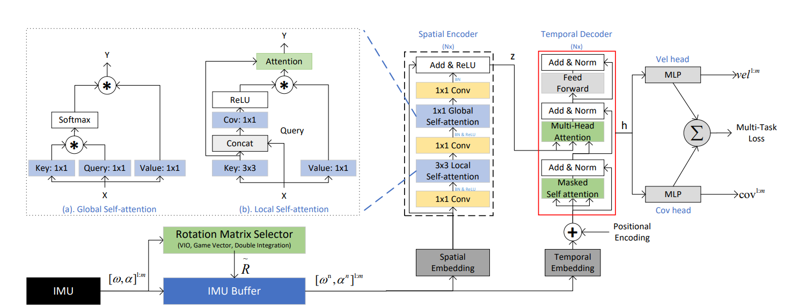

# CTIN: Robust Contextual Transformer Network for Inertial Navigation

This readme file is an outcome of the [CENG502 (Spring 2023)](https://ceng.metu.edu.tr/~skalkan/ADL/) project for reproducing a paper without an implementation. See [CENG502 (Spring 20223) Project List](https://github.com/CENG502-Projects/CENG502-Spring2023) for a complete list of all paper reproduction projects.

# 1. Introduction

The aim of this project is to reproduce the results in the paper titled  [CTIN: Robust Contextual Transformer Network for Inertial Navigation [1]](https://arxiv.org/abs/2112.02143) by Rao et al. published in 36th AAAI Conference on Artificial Intelligence, 2022.

***DISCLAIMER:*** We built this software on top of code of RoNIN [2] and used their dataloader in our experiments.

## 1.1. Paper summary

CTIN is the first paper to facilitate transformers in inertial navigation. Paper introduces spatial encoder and temporal decoder branches for inertial navigation. Spatial branch includes a novel local self attention mechanism and temporal branch consists of transformer decoder layers. The method improves the RoNiN [2] method by Herath et al., which proposes ResNet, LSTM and TCN based networks for inertial navigation. CTIN is state-of-the-art in most of the benchmarks it is tested on, which shows the success of transformer models in inertial navigation.

# 2. The method and my interpretation

## 2.1. The original method


Figure 1: CTIN Method (obtained from [1]).


CTIN takes IMU measurements for a pre-determined window size m, and using the Rotation Matrix Selector, converts the measurements to global frame from body frame. At the Rotation Matrix Selector output, [6, m] measurement vector is obtained. 

The resulting measurement vector is passed to the **Spatial Embedding** branch, which consists of a 1D convolutional neural network.

Spatial embedding output is passed to the **Spatial Encoder**. Spatial encoder consists of Ns identical layers. Each layer consists of modified ResNet-18 blocks where spatial convolutions are replaced with local self-attention mechanism and a global self attention is applied before the last 1x1 downsampling convolution.

**Temporal Embedding** branch takes measurement vector and uses 1D Bidirectional LSTM and Positional Encoder to produce input for the **Temporal Decoder**. Temporal decoder takes the Temporal Embedding output together with Spatial Encoder output to produce output for the two **MLPs** for velocity and covariance.

**Loss:** Network tries to predict velocity and its covarience. Two loss terms, Integral Velocity Loss (IVL) and Covariance NLL Loss (CNL), are used for training the network with a Multi Task Loss. IVL consists of position difference obtained from integration of velocities and ground truth together with cumulative error between predicted and ground truth velocities. CNL tries to maximize the probability of ground truth velocity in the distribution created with estimated velocity and its covariance by looking at the Mahalonobis distance between two velocities.


## 2.2. Our interpretation 


**Spatial Embedding:** Only information for Spatial Embedding in the paper is that it consists of 1D convolutional neural network followed by batch normalization and linear layers. We used 

```python
self.spatial_embedder = torch.nn.Sequential(
    torch.nn.Conv1d(self.input_channels, self.input_channels, kernel_size=3, stride=1, padding=1),
    torch.nn.BatchNorm1d(self.input_channels),
    torch.nn.Linear(self.window_length, self.window_length)
    ) 
```

for the spatial embedder.

**Spatial Encoder:** At the end of Local Self-attention block, there is an attention mechanism. The paper does not include any information for this part. Since the block has two inputs, we selected input coming from left as query and the input from bottom as key and value.

**Temporal Embedding:** Bidirectional LSTM is taken from RoNiN [2] implementation as no information about the parameters is given in the paper. Positional encoding is said to be provided by a trainable neural network. And no information is given for the network structure. We could not implement the positional encoding with the given information.


**Temporal Decoder:** Size for feed forward layer of temporal decoder is set as the default value in TransformerDecoderLayer of Pytorch.

**Vel Head:** For the MLP no details are given in the paper. We used

```python
self.linear_linear_vel = torch.nn.Sequential(
    torch.nn.Linear(self.input_channels, 4),
    torch.nn.BatchNorm1d(self.window_length),
    torch.nn.ReLU(),
    torch.nn.Linear(4, self.output_channels),
    torch.nn.LayerNorm(self.output_channels)
) # Linear layer for linear velocity output 

```
for velocity head.

**Cov Head:** Similar to the velocity head, no details are provided for MLP in Covariance Head. We used the same network with velocity head with a small difference at the end. Since covariance values should be positive all the time, we applied ReLU at the end of the network.

**Testing:** The way of comparing the network output with trajectory is not detailed in the paper. The network should take inputs with specific window size it is trained on. How this window is interpreted to obtain the trajectory is ambiguous. As in RoNiN-ResNet one can only look at the velocity at the end of the window and shift window to obtain next velocity. Or window could be shifted without overlapping and each velocity estimate can be utilized. Because of the time constraints we could not experimented o these two methods enough to choose one of them. 


CTIN model can be found inside source/model_temporal.py file.

# 3. Experiments and results

## 3.1. Experimental setup


Paper states Adam optimizer is used in training with initial learning rate of 0.0005 and weight decay of 1e-6. And early stopping with 30 patience is applied. Spatial Encoder had 1 layer and Temporal decoder had 4 layers in the setup of the paper. Number of epochs used in training is not specified.

## 3.2. Running the code


To run the code
1. Clone the repository.
2. (Optional) Download the dataset <sup>1</sup> from [HERE](https://doi.org/10.20383/102.0543). 

    2. To train/test **CTIN** model:
        * run ```source/ctin.py``` with mode (train/test) and model type. Please refer to the source code for the 
        full list of command line arguments. Optionally you can specify a configuration file such as ```config/temporal_model_defaults.json``` with the data
         paths.
        * Example training command: ```python ctin.py train --type ctin --config <path-to-your-config-file> 
        --out_dir <path-to-output-folder> --use_scheduler```.
        * Example testing command: ```python ctin.py test --type ctin --test_list <path-to-test-list> 
        --data_dir <path-to-dataset-folder> --out_dir <path-to-output-folder> --model_path <path-to-model-checkpoint>```. **NOTE: Testing method is not implemented correctly at this state**

## 3.3. Results


We implemented the forward pass of the algorithm and training can be performed. In the RoNIN dataset, single epoch takes 2 hours on NVIDIA RTX 4060 GPU. However, the test methods could not be finished due to unclear evaluation methods detailed in the paper. The predicted velocity outputs inside a window can be utilized in many different ways for trajectory prediction. We could not implement our own trajectory predictor in the required time and unfortunately no results are presented in this section.

# 4. Conclusion


In this project the implementation of the CTIN paper is provided. The implementation of test methods are not finished in the required time and the results could not be compared with the original paper at this stage.

# 5. References

[1] [Rao, B., Kazemi, E., Ding, Y., Shila, D. M., Tucker, F. M., & Wang, L. (2022, June). CTIN: Robust contextual transformer network for inertial navigation. In Proceedings of the AAAI Conference on Artificial Intelligence (Vol. 36, No. 5, pp. 5413-5421).](https://ojs.aaai.org/index.php/AAAI/article/download/20479/20238)

[2] [Herath, S., Yan, H. and Furukawa, Y., 2020, May. RoNIN: Robust Neural Inertial Navigation in the Wild: Benchmark, Evaluations, & New Methods. In 2020 IEEE International Conference on Robotics and Automation (ICRA) (pp. 3146-3152). IEEE.](https://ieeexplore.ieee.org/abstract/document/9196860)


# Contact

Yunus Bilge Kurt

yunus.kurt@metu.edu.tr
