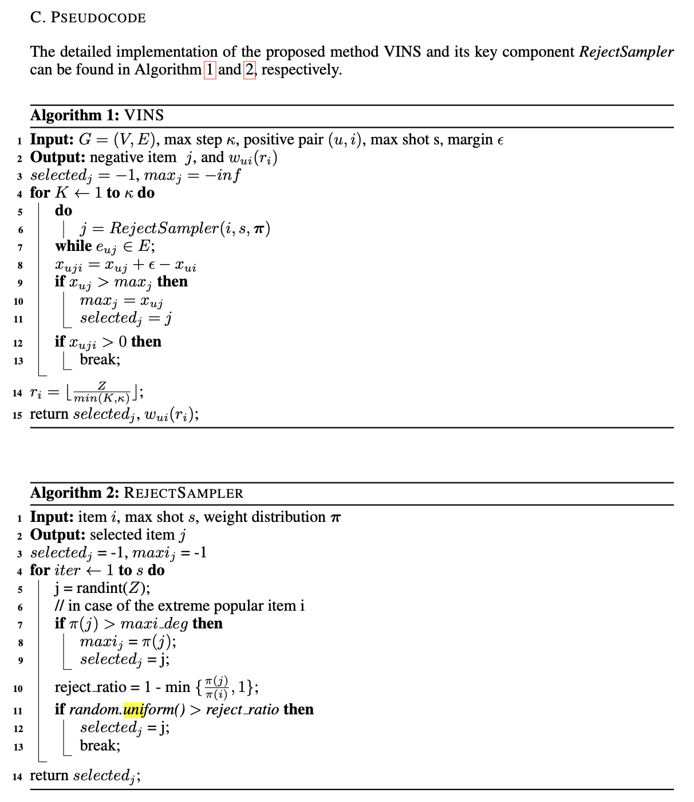
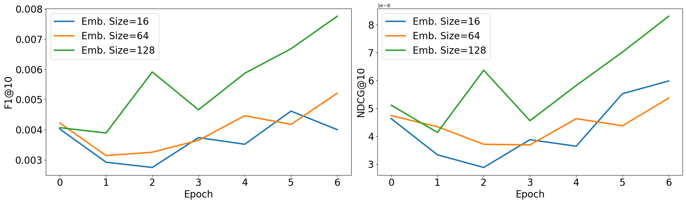
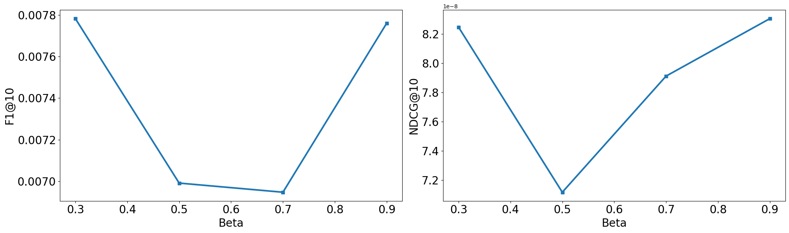
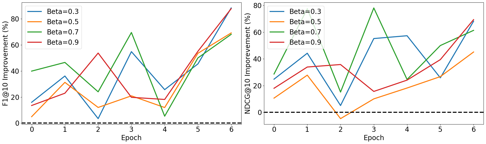

# A SIMPLE AND DEBIASED SAMPLING METHOD FOR PERSONALIZED RANKING

This readme file is an outcome of the CENG502 (Spring 2023) project for reproducing a paper without an implementation. See CENG502 (Spring 20223) Project List for a complete list of all paper reproduction projects.

## 1. Introduction
The paper is published in ICLR 2022 and introduces a performant sampling procedure called Vital Negative Sampler (VINS). In this project, our goal is to implement VINS and train it on Yelp dataset We aim to achieve reported performance in the paper.

### 1.1. Paper summary
Over the recent years, many approaches have been proposed to mine negative samples without data imbalance. Such methods may be:
- User-independent: UNI (Rendle et al., 2009), POP (Mikolov et al., 2013) where negative samples are sampled from a static distribution
- User-dependent: DNS (Zhang et al., 2013) greedily selects the best item (j) with similarity score $x_{uj}$ to user u.
- Edge-dependtent: WARP (Weston et al., 2011) selects the negative item j constrained that it is ranked higher than the positive item i to user u, $ x_{uj} + \epsilon \geq x_{ui}$ . 

where similarity score is calculated as the dot product of user and item embedding vectors: $x_{ij} = U_{i} I_{j}$

VINS builds up on WARP by taking popularity of selected items to account.
 
## 2. The method and my interpretation

### 2.1. The original method

In VINS, a negative item prototype is selected with reject probability $ 1 - \min \big( \frac{\pi(j)}{\pi(i)}, 1 \big )$. $\pi(i)=d_i^\beta$ and $\beta \in [0, 1]$. $d_i$ is the degree of the item and beta is a hyperparameter between zero and one. Then, this process is repeated $\kappa$ times until the sampled prototype has higher rank value compared to the positive item for user u.

By sampling negatives items more popular than the positive item and taking rank position into account, VINS achieves state-of-the-art performance compared to other methods.

### 2.2. Our interpretation

For dataset creation authors share following information. On top of authors' described process we also added a condition where each item in the test set must be present in the training set. Since otherwise there is no information to learn those embeddings. 

> The detailed statistics of the employed datasets can be found in Table 3. Following the processing in (Tang and Wang, 2018; He and McAuley, 2016), we discard inactive users and items with fewer than 10 feedbacks since cold-start recommendation usually is regarded as a separate issue in the literature (He and McAuley, 2016; Rendle et al., 2010). For each dataset, we convert star-rating into binary feedback regardless of the specific rating values since we care more about the applications without explicit user feedbacks like ratings (He et al., 2017a; 2016). We split all datasets into training and testing set by holding out the last 20% review behaviors of each user into the testing set, the rest as the training data.

Also, note that the pseudocode indicates that it is possible for VINS to sample a `NULL` negative item. Although this condition is very rare, we dropped samples that with null negative items at each epoch.

We could not find an indicator on how frequently use VINS as a sampler. Hence we sampled new negative items at each epoch. Also, we took the batch size as 256 as its true value has not been mentioned. Lastly, the pseudocode provided is unoptimized and sampling a whole dataset takes more than 15 minutes per epoch on 1% of YELP dataset using a MacBook Pro 2017 with 8GB memory. Note that the process could be expedited by first sampling $\kappa$ samples in parallel and then scoring each of them in batches. During our implementation, we sticked to the given pseudocode.

## 3. Experiments and results

### 3.1. Experimental setup
As VINS takes too much time to sample without parallelization, we utilized nly 1% of the YELP data. You can find preparation code at `prepare_dataset.py`. We have not included `review.csv` due to its size; however you can find it via this [link](https://drive.google.com/file/d/1kYbVDAwfFuIite6CXJLPRJ6qFWfgCmdF/view?usp=sharing).

In total we have 287,484 and 45,486 training and test samples respectively.
We have utilized matrix factorization as the model (see `modal.py`). Training an epoch took 1-2 minutes per epoch. As the performance bottleneck was sampling (~ 50 minutes) we trained our method on CPU rather than GPU.

Implementation is based on pytorch.

### 3.2. Running the code
We already present training and test data in this repository. In case you want to recalculate them, you can use following command:

`python prepare_dataset.py`

To train the model, please run the following commands:

`pip install -r requirements.txt`

`python train.py --embedding_size [EMBEDDING_SIZE] --beta [BETA] --batch_size [BATCH_SIZE] --max_step [MAX_STEP] --epochs [EPOCHS] --use-vins [1 or 0]`

### 3.3. Results
We have run three types of experiments using the VINS model.

E1. Finding the best beta using hyperparameter search

E2. Finding the best embedding size using hyperparameter search

E3. Comparing performance gain of VINS compared to regular training.

Due to sequential sampling of VINS taking a lot of time, we could train the models for 7 epochs. You can find experiment data under `results/` and figures at `figs/`. Figures are generated at `visualizations.ipynb`. Performance is evaluated on the test set.

We see that larger embedding size result in higher F1 and NDCG (normalized discounted cumulative gain) scores. Each metric is measaured on top-10 results. Our best F1@10 score is 0.76% Note that state of the art F1@10 performance on Yelp dataset is 2.22% according to the paper (Figure 5).

Our beta sweep shows that extreme values of $\beta$ work more performant.

In order to measure the effect of VINS, we trained a baseline model where we sample each negative item randomly. Then measured percent improvement on both F1@10 and NDCG@10 when using VINS compared to the baseline model according to the formula below where $i$ indicates the epoch index:

$ \text{Improvement}_i = 100 * \frac{F_{vins, i} - F_{baseline, i}}{F_{baseline, i}} $

**Our results clearly show the effectiveness of VINS on the baseline. We see that at 6th epoch, VINS performed 60 to 80% better compared to random sampling measured by F1@10 and 40-70% better when measured by NDCG@10.**

## 4. Conclusion

Our experiments show that 60 - 80% F1@10 and 40-70% NDCG@10 improvement can be obtained by using VINS compared to randomly sampling the negative items on 1% of the Yelp dataset.

We believe given pseudocode in the paper is too underperformant for a real world use case and suggest parallelizing the code by:

1. Sampling each negative IDs on parallel
2. Calculating samples' rank score in batches

## 5. References

Steffen Rendle, Christoph Freudenthaler, Zeno Gantner, and Lars Schmidt-Thieme. 2009. BPR: Bayesian Personalized Ranking from Implicit Feedback. In Proceedings of the Twenty-Fifth Con- ference on Uncertainty in Artificial Intelligence (UAI). 452–461.

Tomas Mikolov, Ilya Sutskever, Kai Chen, Greg Corrado, and Jeffrey Dean. 2013. Distributed Rep- resentations of Words and Phrases and Their Compositionality. In Proceedings of the Advances in Neural Information Processing Systems (NeurIPS). 3111–3119.

Weinan Zhang, Tianqi Chen, Jun Wang, and Yong Yu. 2013. Optimizing Top-n Collaborative Filter- ing via Dynamic Negative Item Sampling. In Proceedings of the 36th international ACM SIGIR conference on Research and development in information retrieval (SIGIR). 785–788.

Jason Weston, Samy Bengio, and Nicolas Usunier. 2011. WSABIE: Scaling Up to Large Vocabu- lary Image Annotation. In Proceedings of the Twenty-Second International Joint Conference on Artificial Intelligence (IJCAI). 2764–2770.

## Contact:
Egemen Sert - egemen.sert@metu.edu.tr