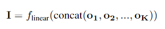
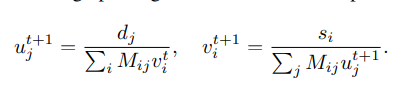

# UniVIP: A Unified Framework for Self-Supervised Visual Pre-training

This readme file is an outcome of the [CENG502 (Spring 2023)](https://ceng.metu.edu.tr/~skalkan/ADL/) project for reproducing a paper without an implementation. See [CENG502 (Spring 20223) Project List](https://github.com/CENG502-Projects/CENG502-Spring2023) for a complete list of all paper reproduction projects.

# 1. Introduction
Self supervised learning aims to train generalizable models without labels by using the data intrinsic learning signals. There is a significant need for labeled data for most computer vision tasks, where object segmentation can be one of the most tedious ones. 

Self-supervised learning methods have achieved on-par or even better results than their supervised counterparts in recent years (also in NLP). However, most available methods focus on iconic datasets (with single objects centered in the image) like ImageNet. For classification tasks, these methods might be sufficient but tasks like object detection and segmentation require learning more detailed representations by taking into account multiple objects in images of varying sizes. For the representations to be useful they have to be taking into account non-iconic samples which are common in datasets like COCO.

One popular method that tries to learn similar representations for differently augmented views of the same image is BYOL [7]. Applying its approach to COCO results in irrelevant cropped regions like the below:


It can be seen that it is very difficult for these boxes to contain consistent image crops, where the model can learn to relate object parts to the same object. A different approach is necessary here which is aware of multiple objects in varying sizes and the whole scene in general.

The paper UniVIP [1] (CVPR 2022) tries to solve this problem. And this repository tries to reproduce their method based on their descriptions in the paper.


## 1.1. Paper summary
Unlike BYOL, UniVIP tries to learn the relation between scenes, between instances, and between scenes and instances. This is explained well in the image below:


In the image, scenes are similar, objects are part of (related) to scenes, and each object is different from the other. This would be indeed a useful learning guide for SSL. Their contributions are towards accomplishing these:

1. Rather than selecting fully random crops, selecting two random scenes with an overlap (where some objects reside) can solve the inconsistency problem in non-iconic datasets like COCO.
2. If available instances in the image are known, together with the random crops (scenes), they utilize scene-to-scene similarity, instances-to-scene similarity, and instances-to instances dissimilarity.

With these updates they achieve superior results both in single-centric (iconic) datasets like imagenet (classification) and non-iconic datasets like COCO and on multiple different downstream tasks.

It is important to mention that, in the literature, there is a paper which BYOL is very related (might be inspired from) called ORL (Unsupervised Object-Level Representation Learning from Scene Images) [3].


Basically, they use BYOL to generate representations of images which they later pair into groups with the k-nearest neighbor method. Then with an unsupervised region proposal algorithm (selective search), they generate RoIs. Next, the pre-trained model is to find top-ranked RoI pairs, on top of which a model is trained which they call object-level representation learning. This three-stage method is smartly simplified by UniVIP.


# 2. The method and my interpretation

## 2.1. The original method

The paper uses directly BYOL's approach to generate random crops from images with slight modifications. The steps are  explained below.

## 2.1.1. Scene to scene

For an image x, two different views (scenes) are generated by applying different augmentations called T1 and T2:


These views are fed to both the online and target network which are not perfectly symmetric (the online network has an additional predictor network appended and the target network is the exponential moving average of the online network). These two different representations are being forced to be close to each other which the cosine similarly loss (which can be represented with mean square error):


Both images with different augmentations are fed to both networks separately and the symmetric losses are added up to update the online network (teach). Here is the final scene-to-scene loss:


But scenes are selected if their overlap contains K number of objects (proposal boxes). These force the scenes to be similar, as explained in the next part in more detail.

## 2.1.2. Scene to instance
An unsupervised instance proposal algorithm called selective search is applied to images with:
- 0.5 IoU threshold
- 1/3 to 3/1 ratio aspect ratio limit
- minimum size is at least 64 pixels constraint

Here is a sample scene-scene-instances group:


  
Then, scenes are proposed as in the first step like BYOL, but it is required that these scenes have an overlap where K box proposals are fully included. For 20 iterations, different random views (scenes) are generated if this criterion was not full-filled. 


Finally, as a backup plan, random boxes are generated considering the 3 constraints listed above. 

The instances in the overlaps are cropped from the original image and resized to K 96x96 regions. These K instances are fed to the online network and the output K representation vectors are concatenated and fed to a linear layer to be mapped to a vector of equal size as the scene's representation:



Then, the same cosine similarity loss is used to calculate the difference between these representations as below:


Differently, scenes are only fed to the target network while instances are fed to the online network here:


## 2.1.3. Instance to instance
Here, optimal transport has been used to match instance representations, the more similar ones are pulled together. Without getting into the details, here we try to map K online instance representations to K target instance representations. If two nodes (representations) are more similar they will produce less transportation cost (which will be minimized by the model). 

To calculate the loss costs between nodes will be multiplied by the optimal transportation plan. Costs between nodes can be found with the cosine similarity between representations, the more similar the less the cost:


Finding the optimal transportation plan is achieved with a fast iterative approach called Sinkhorn-Knopp iteration. This part was not clearly explained in this paper but the paper OTA explains it better[2] (see below). d corresponds to the demander a and s to the supplier b:



The optimal plan can be found by simply this (where M is related to the cost function):


Then, according to the UniVIP paper, we need to find the supplier and demander marginal weights with:


The iterative formula then uses these values to iteratively find the optimal plan Y. If Y is found the loss is:


Where the final loss turns out to be:


## 2.2. My interpretation 
## 2.2.1. Scene and instance related
- BYOL applies non-symmetric transformations (T1 and T2). It was not clear whether type 1 or type2 transformations were applied to instances, hence, I stuck with type 1 (no major difference).
- For scene generation random resized cropping with bicubic interpolation is applied in the paper. Since some augmentation produces non-values if the pixel values are not between 0-1 (like color jitter), I have clamped the output of bicubic interpolation back to 0-1.
- While selecting scenes with overlaps, it was not stated in the pseudo-code directly, but I have assumed that the overlap must have an edge larger than 64 pixels and did not increase the count if not (because the continuation would fail to generate K (4) boxes with iou, max_ratio, and min_size limitations anyways). 

## 2.2.2. Sinkhorn related
- I have noticed that OTA paper (which UniVIP refers to), uses a logarithmic version of Sinkhorn iterations. I could not be sure if that is truly the same as Sinkhorn operations hence asked the original author of the logarithmic version (Prof. Gabriel Peyre, see here https://github.com/gpeyre/SinkhornAutoDiff/blob/master/sinkhorn_pointcloud.py).
- As this paper uses Sinkhorn-Knopp optimization inspired by the OTA [2] paper, I used their values for iterations T and epsilon value (50 and 0.1 respectively.). UniVIP did not state these values explicitly.

## 2.2.3. Performance related
- The performance of the method was not clearly stated, but, I have observed a significant boost-up (6 fold compared CPU loading), when changing the `__get_item__()` method of the dataset to perform some operations on the GPU (shared on multiple devices) as follows (`get_concatenated_instances` can benefit a lot from parallelization, as it includes cropping multiple RoIs from images.):

```
scene_one, scene_two, overlapping_boxes = scene_one.to(worker_id), scene_two.to(worker_id), overlapping_boxes.to(worker_id)
concatenated_instances = get_concatenated_instances(img, overlapping_boxes)
if scene_one.shape[0] == 1:
    scene_one, scene_two, concatenated_instances = scene_one.expand(3, -1, -1), scene_two.expand(3, -1, -1), concatenated_instances.expand(K_COMMON_INSTANCES, 3, -1, -1)
```

## 2.2.4. Optimization related
- The paper does not state explicitly, but, BYOL's cosine similarity loss can be interpreted as a mean square error and I have interpreted scene-to-scene and scene-to-instance losses likewise. As in this method:
```
def byol_loss_fn(self, x, y):
    """Cosine similarity is (proportional (/2)) to MSE when x-y are l2 normalized
    https://stats.stackexchange.com/questions/146221/is-cosine-similarity-identical-to-l2-normalized-euclidean-distance"""
    # L2 normalization (Divided L2 norm), hence, resulting l2_norm = 1 --> MSE = cosine_sim 
    x = F.normalize(x, dim=-1, p=2) # 
    y = F.normalize(y, dim=-1, p=2)
    return (2 - 2 * (x * y).sum(dim=-1)).mean()
```
- They say that they use linear warm up in the first 4 epochs to increase the learning rate. I was not sure whether they took a step every epoch or every iteration, hence, I increased it every iteration.

## 2.2.5. Box generation related
- In the paper they state that they apply a naive strategy when it is not possible to get overlapping scenes with K instances in certain trials (20) for every image, in which case they apply a naive strategy (not selective search). They did not clearly explain this part and I have asked the authors. One of them replied that they generated random boxes obeying the constraints applied to selective search proposals (iou_threshold and such). How they did this was also not very clear, so I simply sampled 100 different x,y,w,h values from an acceptable linear distribution and filtered them. If an acceptable box was produced I added it to the proposals, if not, I took the best random box, *even if it has a large IoU than 0.5*, this is because I did not want the training procedure to lose too much time here.
- There were two images in the COCO dataset which had an edge smaller 64 where my code was failing (getting stuck in finding satisfactory scenes). They should have very little impact on the final results, hence, I have discarded these images in the dataset.


# 3. Experiments and results
*NOTE:* This project could not manage to start a fully healthy training. In the final training I was running I observed NaN values in the output of the encoders in the 53th epoch (no NaN value until then). If I had more time I would re-load the final saved weights (checkpoint) and find out the root of the NaN values. Most probably it is not related to overshooting, but, a rare event where boxes or augmentations are causing this error. Sadly, results on downstream tasks like linear probing, object detection, and segmentation could not be generated which require extra training on downstream tasks. Debugging and training self-supervised methods are particularly very difficult and time-consuming as the required training time is 1 to 2 weeks. Even if careful, some problems arise during or after training. Writing a "bug-free" training code requires a lot of time and effort, which is worth it since having the wrong training code will result in wrong results anyways. By being reliable, this project hopefully will be more helpful to the academy and open source community.


## 3.1. Experimental setup

To train the SSL method, first, you need to generate proposal boxes with the selective search for the COCO train2017 dataset. It has also been trained for unlabelled2017 and ImageNet datasets. Then you should run the training code with 8 GPUs (with distributed data-parallel) with 512 batch size (minimum of 32 GB VRAM required). The steps are further explained below:

## 3.2. Running the code
### 3.2.1. Generating box proposals
#### (RECOMMENDED) Using already generated proposals to create filtered Bbox proposals 

From the repo `https://github.com/Jiahao000/ORL/tree/master`, download the non-filtered object proposals generated with selective search. Note that the steps below could have been integrated into a single script for simplicity, but their requirement was understood on the go, hence, they remained as they are (time limitation).

*Repeat the steps below both for train2017 and unlabelled2017 COCO dataset:*
1. To speed up loading the JSON file (~5GB) convert it to a pickle file with `data_ops/generate_proposals/json_to_pkl.py` (specify the path with `file_path`).
2. Filter out small bounding boxes with `data_ops/generate_proposals/post_filter_boxes.py` (specify the path with `TARGET_PKL`).
3. Enumerate the pickle file per image to sort them accordingly with `data_ops/enumerate_bbox.py`. (specify the path with `PICKLE_FILE`).
4. Match boxes with image names with `data_ops/name_pkl.py` (specify the path with `TARGET_PKL`). Note that you have to modify `ANNOTATION_INFO` with `instances_train2017.json` or `image_info_unlabeled2017.json` paths from the COCO dataset.
5. Finally convert the .pkl file contents from lists to tensors with `data_ops/pkl_convert_tensor.py`

At the end, you will have pkl files with bounding box proposals (filtered for 64 min_size according to UniVIP) and image names matched.

#### (NOT RECOMMENDED) Re-generating bounding box proposal generation with selective search

1. Copy the python scripts in `ORL_files` to the repo ORL to run the command `bash dist_selective_search_single_gpu.sh configs/selfsup/orl/coco/stage2/selective_search_train2017.py univip_instances_train2017.json` in ORL (get from `https://github.com/Jiahao000/ORL/tree/2ad64f7389d20cb1d955792aabbe806a7097e6fb` and install runtime.txt dependencies and install this for selective search `pip3 install opencv-contrib-python --upgrade`).
2. Replace the code in `selective_search_iou.py` and `/home/utku/Documents/ODTU/CENG502/project/ORL/openselfsup/datasets/selective_search.py` to apply iou_tresh together with selective search.
3. Then generate the proposal boxes with the selective search for min_size 64.

### 3.2.2. Training the method

1. In `train/dataloader.py`, modify this line to point to your PKL file with the box proposals: `ORI_FILTERED_PKL = <BOX_PROPOSAL_PATH>`. And this line to point to COCO train2017 images: `DATASET_PATH = <train2017>`.
2. Modify `LOG_DIR` in `train/train.py` to the point where you want to log your training progress and weight file. 
3. Set `USE_DDP=True` in `train/train.py`, assuming that you want to train with multiple GPUs. You can adjust the device settings further in this file if you are not satisfied with the current devices.
4. Simply `cd train` and start training with `python3 train.py`. Training will start after the pkl file and the dataset is loaded. (ignore the warning related to CUDA )

# 4. Conclusion
This project tried to reproduce the results of UniVIP which tries to improve self-supervised learning in the vision domain for non-iconic datasets like COCO. The results could not be produced due to persisting errors in the training procedure which arise unexpectedly after very long training (50 epochs take half a day, which was the frequency of the final NaN outputting encoder error.). SSL in images with many objects is an interesting research direction and very important for the industry also. Eventually, I hope that this project will be of help to researchers interested in this field.

# 5. References

1. Z. Li, Y. Zhu, F. Yang, et al., "UniVIP: A Unified Framework for Self-Supervised Visual Pre-training," in Proceedings of the IEEE Computer Society Conference on Computer Vision and Pattern Recognition, 2022, pp. 14607-14616.
2. Z. Ge, S. Liu, Z. Li, et al., "OTA: Optimal Transport Assignment for Object Detection," in Proceedings of the IEEE Computer Society Conference on Computer Vision and Pattern Recognition, 2021, pp. 303-312.
3. J. Xie, X. Zhan, Z. Liu, et al., "Unsupervised Object-Level Representation Learning from Scene Images," in Proceedings of the IEEE Computer Society Conference on Computer Vision and Pattern Recognition, Year, pp. Pages.
4. J. Xie, "ORL," GitHub. [Online]. Available: https://github.com/Jiahao000/ORL.
5. Megvii-BaseDetection, "OTA," GitHub. [Online]. Available: https://github.com/Megvii-BaseDetection/OTA.
6. G. Peyré, "SinkhornAutoDiff - example_sinkhorn_pointcloud.py," GitHub. [Online]. Available: https://github.com/gpeyre/SinkhornAutoDiff/blob/master/example_sinkhorn_pointcloud.py.
7. J.-B. Grill, F. Strub, F. Altché, C. Tallec, P. H. Richemond, E. Buchatskaya, C. Doersch, B. A. Pires, Z. D. Guo, M. G. Azar, B. Piot, K. Kavukcuoglu, and J. Carreira, "Bootstrap your own latent-a new approach to self-supervised learning," in Proceedings of the 34th Conference on Neural Information Processing Systems, Vancouver, Canada, 2020, pp. 21271-21284.

# Contact

Name: Utku Mert Topçuoğlu
email: utkumerttopcuoglu@gmail.com
