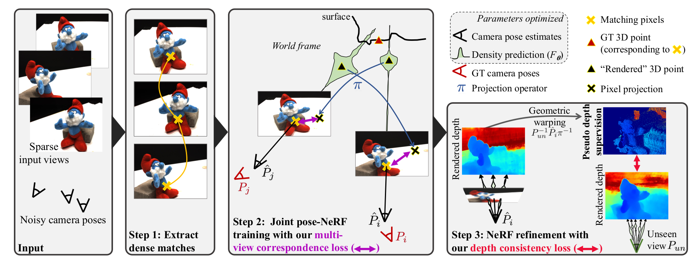
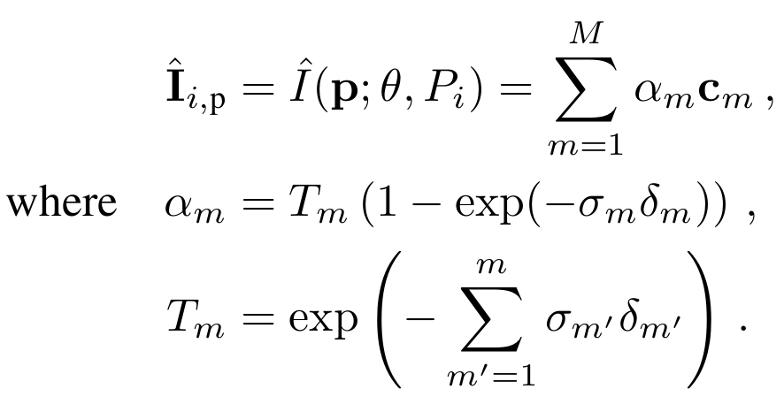
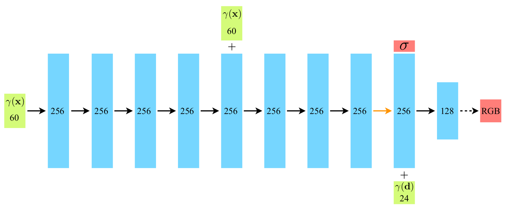
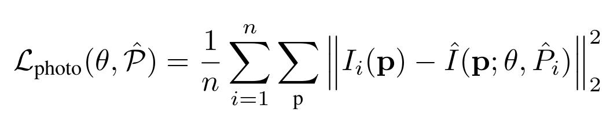
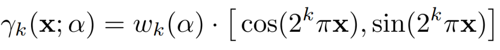
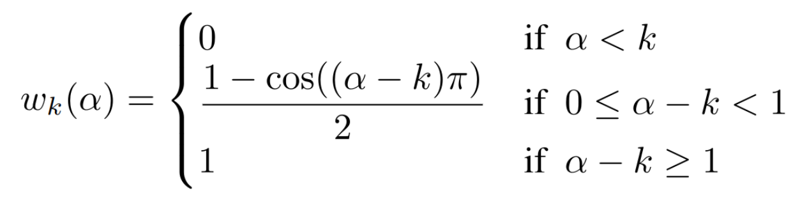
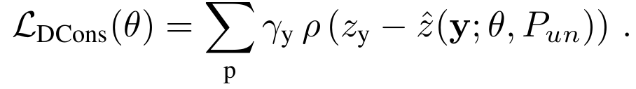
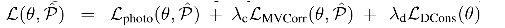

# SPARF: Neural Radiance Fields from Sparse and Noisy Poses

This readme file is an outcome of the [CENG502 (Spring 2023)](https://ceng.metu.edu.tr/~skalkan/ADL/) project for reproducing a paper without an implementation. See [CENG502 (Spring 20223) Project List](https://github.com/CENG502-Projects/CENG502-Spring2023) for a complete list of all paper reproduction projects.

# 1. Introduction

SPARF: Neural Radiance Fields from Sparse and Noisy Poses is a NeRF-family paper published in CVPR2023, by Prune Truong, Marie-Julie Rakotosaona, Fabian Manhardt and Federico Tombari.

In this paper, the authors inspect the effect of the pose quality and quantity on the overall quality of a Neural Radiance Field. They state that unavailibity of dense input views and inaccurate camera pose data limit the real-world application of NeRFs. To address these challenges, they propose SPARF, a Novel-view Synthesis model given only few input images, and also noisy camera poses.

In this project, I will try to implement the Joint Pose-NeRF training method described in the paper, and reproduce their results.

## 1.1. Paper summary


The number of posed camera images and the accuracy of the camera poses has an important effect on NeRF quality. However, in practice, these might not be accessible for every scene. In this paper, the authors propose SPARF, a joint pose-NeRF training strategy and an improved objective function to compensate for the lack the accuracy of camera poses, and the low number of images.

In SPARF, the model can produce novel-view renderings given only few (as low as 3) imagesd with noisy camera poses. By multi-view geometry, they propose Multi-View Correspondence Loss, that checks for correspondence between input images, and tries to minimize the re-projection error using depth calculated by the NeRF model. Further, they also deploy Depth Consistency Loss, in order to reduce inconsistencies from novel view points.

SPARF increases the quality of renderings compared to other existing methods, given smaller number of views. However, as the model depends on Correspondence between image pixels, the model is limited to datasets where each image has covisible regions with at least one other.


# 2. The method and my interpretation

## 2.1. The original method




### 2.1.1 NeRF Training

They follow the original NeRF[4] paper for training and inference. During training, they follow the following algorithm:

1. For each training view:
2.	Shoot a ray through each pixel
3.	For each ray, sample 256 points along the ray
4.	Forward pass the samples through shallow MLP
5.	Compute pixel value based on the output of the MLP at sample points
6.	Compute Photometric loss between computed view and training view

Pixel values are calculated with the following formulas:




The original method uses the original NeRF model as its backbone. The MLP model is given below:




The following Photometric Loss function is used during training:




The original NeRF paper uses positional encoding for the inputs to MLP. The SPARF paper uses a positional encoding method used in BARF[3]:



The weights above are calculated with the following:



Where $\alpha$ value is a parameter proportional to the optimization progresss.


The trained model produces realistic novel views, however, under the constraint of limited number of image, solely Photometric Loss Function fails in sparse regions.


To overcome this, the authors propose two other objective functions, which enforces multi-view consistency and depth consistency.


### 2.1.2 Multi-View Correspondence Loss

Given two images $I_i$ and $I_j$, there exists two pixels p and q, such that p in I_i corresponds to q ,n I_j. Thus, they must backproject to the same point in the world coordinate system. Therefore, the authors define a novel consistency loss that minimizes the distance between their 3D backprojections.


During training, at each iteration, two input images are sampled randomly, and their pixel-wise correspondence is calculated. For each point correspondence, we calculate the following formula.


PDC-Net is used for the correspondence computation.

### 2.1.3 Depth Consistency Loss

The scenes suffer from inconsistencies on novel view due to lack of input images. This problem mostly occurs in areas where no RGB supervision is available. To address the problem, they propose another training objective, called Depth Consistency Loss.

The idea is to use the rendered depths for novel viewpoints. They sample virtual poses by interpolating two close-by training views. Then, a pixel p in a sampled training image $I_i$, they find its corresponding 3D point in the coordinate system of the unseen sampled view. They also render its depth by using the network and minimize the distance between the two values.

The loss is defined as:




### 2.1.4 Objective Function

Combining Photometric Loss, MVC Loss and Depth Consistency Loss, we have the following objective function:



Where $\lambda_c$ and $\lambda_d$ are predefined weighting factors that are halved at each 10k iterations.


### 2.1.5 Training algorithm

At each iteration:

1.	Sample x random pixels from all the training images
2.	Render views corresponding to their positions
3.	Calculate Photometric Loss
4.	Sample two image pair, apply Multi-view Correspondence Loss on a random subset
5.	Sample a training view $I_i$ associated with camera $P_i$
6.	Find another training view $I_j$ and $P_j$ closest to $I_i$ and $P_i$
7.	Compute an unknown camera pose as an interpolation
8.	Randomly sample n pixels from $I_i$
9.	Compute Depth Consistency Loss

## 2.2. Our interpretation 

The methods are explained well in the paper and its appendix. I followed the paper throughout the implementation. However, concepts about the datasets and some parts of the study (such as positional encoding, NeRF model details, etc) were left vague by the SPARF paper, and the reader is directed to read the corresponding papers, such as pixelNeRF[2], BARF[3] and NeRF[4]. I followed their methodology in such cases.

I did not implement the Depth Consistency Loss due to time constraints and as it was reported to have minor effects on the output.


# 3. Experiments and results

## 3.1. Experimental setup

The model is traing on DTU, LLFF and Replica datasets. I have focused on DTU Dataset. The model is trained for 100k iterations, which takes about 10 hours on a single A100 GPU.

For correspondence prediction, they used PDC-Net[5].

During trained, they used the evaluation protocol from pixelNeRF[2] and used the following image IDs for input:
```
25, 22, 28, 40, 44, 48, 0, 8, 13
```

Where, the following scans are used as the test set:

```
8, 21, 30, 31, 34, 38, 40, 41, 45, 55, 63, 82, 103, 110, 114
```


## 3.2. Running the code

In order to run the training procedure, use the following snippet:
```
	python train.py <scene>
```
Where "scene" is a scan from a preprocessed version of DTU dataset, taken from PixelNeRF.[pixelNerf][2]

The NeRF model and required geometric functions reside in models.py file. The Loss functions are located in losses.py file.

## 3.3. Results


I was unable to reproduce the paper as my model failed to converge. 

# 4. Conclusion

The reason for lack of convergence in my implementation might be an error on the MVC Loss, or the lack of Depth Consistency Loss.

# 5. References


[1] Truong, P, Rakotosaona, M, Manhardt, F, Tombari, F. "SPARF
Neural Radiance Fields from Sparse and Noisy Poses". (CVPR) 2023

[2] Yu, A, Ye, V, Tancik, M, Kanazawa, A. "pixelNeRF
Neural Radiance Fields from One or Few Images". (CVPR) 2021

[3] Lin, C, Ma, W, Torralba, A, Lucey, S. "BARF: Bundle-Adjusting Neural Radiance Fields". (ICCV) 2021

[4] Mildenhall, B, Srinivasan, P, Tancik, M, Barron, J, Ramamoorthi, R, Ng, R. "NeRF
Representing Scenes as Neural Radiance Fields for View Synthesis". (ECCV) 2020

[5] Prune Truong, Martin Danelljan, Luc Van Gool, & Radu Timofte (2021). Learning Accurate Dense Correspondences and When To Trust Them. In IEEE Conference on Computer Vision and Pattern Recognition, CVPR 2021, virtual, June 19-25, 2021 (pp. 5714–5724). Computer Vision Foundation / IEEE.

# Contact

Şahin Umutcan Üstündaş (umutcan.ustundas@metu.edu.tr)